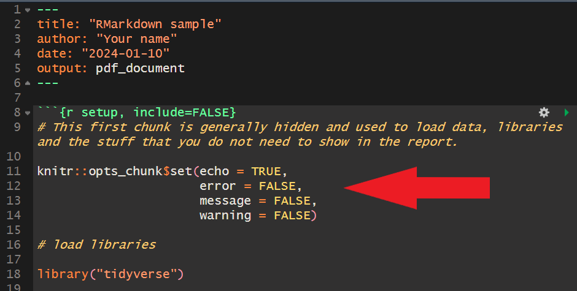

```{r setup, include=FALSE}
knitr::opts_chunk$set(echo = TRUE)
library(tidyverse)
```

# Welcome!

 - Welcome to the first quiz section of CS\&SS / SOC / STAT 321! 
 - I am Lucas Owen (leo4@uw.edu), I am a Ph.D. student in Political Science.
 - My research interest are in \textbf{political economy} and \textbf{applied statistics}.
 - My [office hours](https://www.polisci.washington.edu/people/lucas-owen) are Tuesdays, 9:30-11:20 in Smith 35
 
# Now it's your turn

  - \textbf{Name} and major/year (or intended major)? 
  
\vspace{5mm}

  - \textbf{Why} are you taking this course?  
  
  
\vspace{5mm}

  - \textbf{What} is your experience with R? (no shame!)

# Section Expectations

Sections are designed to complement lectures by reviewing theoretical concepts and learning computational skills in R. We meet twice a week, on Tuesday and Thursday. The section contents are divided into modules dedicated to “best practices” in R programming, theory review, data wrangling, visualization, and statistical analysis in R. These modules consolidate techniques learned in lectures and QSS tutorials while introducing new skills relevant to the course content. All lab materials will be shared on Canvas.

Homework Submission: Submit homework in PDF format using RMarkdown to integrate text, graphic outputs, and code chunks. Render (“knit”) your work into a single PDF file and upload it to the Canvas course website under the appropriate assignment.

# \texttt{R} setup


  - How to install \texttt{R} and \texttt{R-studio}.
    - R-4.4.2 for [Windows](https://cran.r-project.org/bin/windows/base/)
    - R-4.4.2 for [macOS](https://cran.r-project.org/bin/macosx/)
        
  - R-studio can be downloaded from [posit's repository](https://posit.co/download/rstudio-desktop/#download).

  - I recommend this [tutorial](https://www.dataquest.io/blog/tutorial-getting-started-with-r-and-rstudio/) from Casey Bates for an overview of R and RStudio.

  - For Mac users, installation of the **qss** package may sometimes fail if **pandoc** or **curl** is not installed or updated on your Mac. To resolve this, you can:
  
      1. Install the package manager [Homebrew](https://brew.sh/) package.
      2. Then use the macOS terminal to install **pandoc** or **curl** using the commands `brew install pandoc` or `brew install curl`.


# Useful free online \texttt{R} resources 

  - Introductory:
    - Grolemund ([2014](https://rstudio-education.github.io/hopr/)) *Hands-On Programming with R.*
  
  - Intermediary:
    - Wickham et al. ([2023](https://r4ds.hadley.nz/)) *R for Data Science.* 2nd Edition.

  - \texttt{R Markdown}
    - Xie et al. ([2022](https://bookdown.org/yihui/rmarkdown/)) *R Markdown: The Definitive Guide*
  
- Others
   - [Stack Overflow](https://stackoverflow.com).
   - [ChatGPT](https://openai.com/blog/chatgpt)
  


# Project management and working directory

  - A good practice is to keep your projects and files organized and tidy.
      - **Avoid** accumulating data and R files in your **downloads folder**.
  - I recommend creating an **R project** file in your course folder materials. R projects have several advantages:
      - Centralized and efficient *workflow*.
      - Sets the **current** (*root*) working directory.
      - See more in Martin Chan's [beginner's guide](https://martinctc.github.io/blog/rstudio-projects-and-working-directories-a-beginner%27s-guide/).
      

# What are working directories?

  - A **directory** is a **folder** in a file system that stores files and other sub-directories. 
  - A **path** is a string that specifies the **location** of a directory in a file system.
  - For example:
    - `D:\Google Drive`
    - `D:\Google Drive\Phd UW\Courses\Third Year\CSSS 594 - Text as Data`
  - When you **run** a command or script, R looks for files and sub-directories based on **relative paths** to your current working directory.
  
# Absolute and relative paths

  - **Absolute Path**: Specifies the full path from the **root directory** to a file or subdirectory, for example:
  
    - `D:\Google Drive\Phd UW\Courses\Third Year\CSSS 321\scripts\setting_up.R` 
    - is an **absolute path** from:
      - the **root directory**,     "`D:\`" 
      - running through several **subdirectories**, "`\Google Drive\Phd UW\...\CSSS 321\scripts`"
      - to the script **file** "`setting_up.R`"


# Absolute and relative paths

  - We can set absolute paths as **working directories**, rooting them as the default path when working in R.
  
  - Once we set a working directory, we can access to **subdirectories** using relative paths.

  - **Relative Path** is a path relative to the current working directory, for example: 
    - if the **working directory** is set in 
      - `D:\Google Drive\Phd UW\Courses\Third Year\CSSS 321`, 
    - then we can access to the file "`setting_up.R`"
    - Using the **relative path** 
      - `scripts\setting_up.R`


# Project management: working directory
  - **.Rproj** (R Project File) in your project folder establishes the working directory as its absolute path upon opening R.

```{r, echo=FALSE, out.width="80%", fig.align='center'}

```

  - Employing **.Rproj** and **relative paths** in R streamlines project management and collaboration by overseeing files, inputs, and outputs.
    - **Live demostration** of how to create and manage an R Project File.

# Project management: workflow

```{r, echo=FALSE, out.width="50%", fig.align='center'}
knitr::include_graphics("images/rproject_workflow.png")
```


# Working directories: obsolete practices

  - Workflow with *.Rproj* is relatively **new**.
  - Until recently, users had to **manually set** working directories using **functions** or specialized **packages**. See example:

```{r eval=FALSE}
setwd() # function to set directory

setwd("D:/Google Drive/Phd UW/Courses
      /Third Year/CSSS 594 - Text as Data
      /presentation") # remember to put quotes
```


# What are **functions**?

- They are a **set of instructions** that performs a specific task in R.

-  Functions often take one or more **arguments**, which are inputs that are used to customize the behavior of the function.

-  The `mean()` function takes one **required** argument, which is the vector of numbers to calculate the mean of.

\small
```{r}
# create a vector consisting of midterm scores.
grades_M <- c(76, 82, 94, 45, 75)

# calculate the mean using the mean() function
mean(grades_M)
```


# What are **functions**?

- the `mean()` function also has additional optional arguments, which can be used to further customize the behavior of the function.

\footnotesize
```{r}
# create a vector consisting of final scores.
grades_F <- c(82, 90, 89, NA, 64)

# calculate the mean using the mean() function
mean(grades_F)

# use the argument `na.rm` to evaluate the removal of NAs
mean(grades_F, na.rm= TRUE)
```

  - **Remember**: use `?` or `help()` to see the documentation of a function. 


# \texttt{R-Markdown}


- Save the following [Cheat Sheet](https://raw.githubusercontent.com/rstudio/cheatsheets/main/rmarkdown-2.0.pdf) for `RMarkdown`.

- If any of you is looking for an general introduction for `RMarkdown`, I suggest you to check [Chapter 27](https://r4ds.had.co.nz/r-markdown.html) from Wickham and Grolemund ([2017](https://r4ds.had.co.nz/index.html)) - **R for Data Science**.

- If you want a more comprehensive guide, then check Xie et al. ([2021](https://bookdown.org/yihui/rmarkdown/)) - **R Markdown: The Definitive Guide**.

- Another, more applied, resource is Xie et al. ([2022](https://bookdown.org/yihui/rmarkdown-cookbook/)) - **R Markdown Cookbook**.

# \texttt{R-Markdown}


- `RMarkdown` is a document format that allows you to integrate `R` **code** and **output** into a single document. 

- Besides `R` code and output, it can also include **text**, **images**, and other **multimedia elements**, allowing for rich and informative documents.  


- *Pandoc* is a free and open-source **document converter** that can convert documents from one markup language to another.  


  - In the context of `Rmarkdown`, pandoc is the underlying document converter (sfotware) that converts the R-markdown file into a final output format, such as **HTML**, **PDF**, or **Word**.


# \texttt{R-Markdown}


- The output format of the final document can be customized using options in the **YAML header** or external templates.


```{r, echo=FALSE, out.width="60%", fig.align='center'}
knitr::include_graphics("images/YAML.PNG")
```


- The YAML header in RMarkdown is a block of configuration settings at the beginning of the document enclosed by three hyphens (`---`).


- It is used to specify document metadata and other settings such as the document title, author, output format, and more.

# \texttt{R-Markdown}

- **Code chunks** are sections of `R` code that can be executed and embedded within an `RMarkdown` document.

```{r, echo=FALSE, out.width="100%", fig.align='center'}
knitr::include_graphics("images/chunk.PNG")
```


  - Code chunks can be inserted using the syntax `{r}` and closed with ```. 
  
    - Short cut in Windows: \texttt{Ctrl + Alt + I}
    - Short cut in macOS: \texttt{Cmd + Option + I}


- Code chunks can be customized with various **chunk options**.

- **Note**: set the function `knitr::opts_chunk$set()` with any general setting without repeating it in every code chunk.


# \texttt{R-Markdown}

- Frequently used chunk options

Option  |   Description
- | -----
include  |  If `FALSE`, knitr will run the chunk but **not** include the chunk in the final document
echo     |  If `FALSE`, knitr will **not** display the code in the code chunk above it’s results in the final document.
error    |  If `FALSE`, knitr will **not** display any error messages generated by the code.
message  |  If `FALSE`, knitr will **not** display any messages generated by the code.
warning  |  If `FALSE`, knitr will **not** display any warning messages generated by the code.


# Recommendation for Homework


Option  |  HW setting
--- | --- 
include  | TRUE  | 
echo     | TRUE  | 
error    | FALSE  | 
message  | FALSE  | 
warning  | FALSE  | 

```{r, echo=FALSE, out.width="60%", fig.align='center'}

```


# \texttt{R-Markdown}


- In `RMarkdown`, **rendering** a document means converting the source `RMarkdown` file into its final output format (using pandoc).


- To render a document, we need to \texttt{Knit}, knitting is the process of taking the RMarkdown file and converting it into a single, cohesive document that can be rendered into different formats (HTML, PDF, etc).


  - To produce **PDF file**, you need \texttt{TeX} files.

* Easy way: Install the `tinytex` package: `install.packages("tinytex")`. Then run `tinytex::install_tinytex()`.


# `Knitting`

- To knit:

```{r, echo=FALSE, out.width="80%", fig.align='center'}
knitr::include_graphics("images/knitting.PNG")
```

- Auxiliary window for output preview:

```{r, echo=FALSE, out.width="60%", fig.align='center'}
knitr::include_graphics("images/knit.PNG")
```


# Working directories and \texttt{R-Markdown}

- When opening an `RMarkdown` file, this will set the file location as the **working directory**.

- Change the following option in the **global options** to avoid this behavior:

```{r, echo=FALSE, out.width="100%", fig.align='center'}

```


# \texttt{R-Markdown}

- Live demonstration and in-class exercise:

  - Open the file `RMarkdown_sample.Rmd`


# Getting help: reading the error messages

Reference: [David Robinson](http://varianceexplained.org/courses/errors/)

```{r,eval=FALSE}
x <- 10 + foo
```

`Error: object 'foo' not found`: You tried to access a variable that doesn’t exist. 

You might have:

* **misspelled** the variable name

* incorrectly **capitalized** the variable name (R is case sensitive!)

* **forgotten** to run the line that defines the variable in the first place, or run into an error on that line.


# Getting help: reading the error messages

```{r,eval=FALSE}
x <- foo(...)
```

`Error: could not find function "foo"`: You tried to use a function that doesn’t exist. You might have:

* **misspelled** the function name 

* incorrectly **capitalized** the function name 

* forgotten to **load the library** that provides this function.


# Getting help: reading the error messages

```{r,eval=FALSE}
x <- c(1:10))
```

`Error: unexpected ')' in ...`: There is an extra end parenthesis in your line 

```{r,eval=FALSE}
x <- 10; y <- 20
mean(x y)
```

`Error: unexpected symbol in ...`: The most common cause of this is forgetting a punctuation mark such as a comma: for example, `foo(bar1 bar2)` instead of `foo(bar1, bar2)`. 

`Error: unexpected numeric constant` is similar: it just means the value after the missing punctuation is a number (for example, `x 2` instead of `x = 2`).


# Getting help: reading the error messages


```{r,eval=FALSE}
paste("welcome to CSSS, 321)
```

- You might see a `+` sign in the interpreter after you hit return. This means the previous statement is unfinished: 

\vspace{1mm}
  - it might have an **open parenthesis** that never closes, 
  
  \vspace{1mm}
  
  - an open `"` or `'` that is unmatched, or 
  
  \vspace{1mm}
  
  - it could end with an operator like `+` or `-` that expects the line to continue afterwards.

\vspace{1mm}

- Find the problem in your previous lines (count parentheses, and check your quotes) and fix it.


# Getting help: Using the Internet to Your Advantage

  - When encountering coding error messages, use Google or post on [Stack Overflow](https://stackoverflow.com/) for solutions.
  
  - Both beginners and experts often rely on online searches for coding assistance.

  - For example, let’s say that I want to know how to rename a column in my dataset. I could Google:
    - *“How to rename a column in R”* ... and look to the answer.
    - Make sure that you understand the terminology.


# Getting help: minimal reproducible example

- If you feel stuck with an error, seek help but remember to provide **reproducible code** in an R-script file:
\vspace{1mm}
  1. Load necessary **packages** at the beginning.
  
  \vspace{1mm}
  
  2. Include all code up to the error, or at least the **necessary** to reproduce it.
  
  \vspace{1mm}
  
  3. **Comment** your code for clarity.
  
  \vspace{1mm}
  
  4. If applicable, send the necessary **data** to reproduce the error.


# Getting help: practice

  - Open the file `common_errors.Rmd`, and try to solve the problems.
  
# Quick reminder:

  - Relative paths are ideal, but if you're having trouble loading data you can trouble shoot by checking / setting absolute paths.
  
```{r, error=T}
#let's set the wrong working directory
setwd("C:/Users/lucas/Desktop/Files/Doctorate/Year 6/Q2 (Winter)/CSSS 321/CSSS-321-main/scripts")

#we get an error and are unable to load the file
boston <- read.csv("data/boston.csv")
```

# Quick reminder:

  - Relative paths are ideal, but if you're having trouble loading data you can trouble shoot by checking / setting absolute paths.
  
```{r}
#troubleshooting - let's check what our current working directory is
getwd()

#it's wrong. let's change it back
setwd("C:/Users/lucas/Desktop/Files/Doctorate/Year 6/Q2 (Winter)/CSSS 321/CSSS-321-main")

#now we can load the file
boston <- read.csv("data/boston.csv")
```
  

# Running \texttt{R} code and operators

\small
```{r}
# Arithmetic Operators
1 + 1 

2 * 8

9 / 3

2^3
```

# Running \texttt{R} code and operators

\small
```{r}
# Relational Operators
10 > 8 # is 10 bigger than 8?

7 <= 6 # is 7 less or equal to 6?

(2 * 5) == 10 # is 2*5 equal to 10?

1 != 2 # is 1 unequal to 2?
```

# Objects in \texttt{R}: vectors and assignment

\small
```{r}
# Concatenate vectors into a new vector
c(1, 2, 3)

# Assign them to a new object for manipulation
x <- c(1, 2, 3)
print(x) # or simply, x

# Operators on vector
x + 1
x + x

# Logical test on vector
x == 1
```

# Objects in \texttt{R}: vectors and functions

\small
```{r}
# Use an object as input to a function
x <- c(1, 2, 3)

# Functions take input(s) and produce output(s)
class(x)

length(x)

mean(x)
```

# Objects in \texttt{R}: introductory tips
- Unless you assign (`<-` ) some operations or transformations to an object, those values will not be registered 

\small
```{r}
x <- c(1, 2, 3)
print(x + 1)
print(x)
x <- x + 1
print(x)
```

# Objects in \texttt{R}: introductory tips
- New assignment will overwrite the original values if you assign some values to an existing object. It is a **major** source of errors. One advice is to keep distinct object names

\small
```{r}
x <- c(1, 2, 3)
length(x)

x <- c(1, 2, 3, 4, 5)
length(x)
```


# Objects in \texttt{R}: atomic vectors
- Most common types of atomic vectors: **numeric (integer, double)**, **logical**, **character**

\small
```{r}
x <- c(1, 2, 3)
class(x)

y <- c(TRUE, FALSE, FALSE)
class(y)

names <- c("Peter", "Paul", "Mary")
class(names)
```

# Objects in \texttt{R}: atomic vectors
- You can also coerce one type of vector into another: 

\small
```{r}
x <- c(1, 2, 3)
x <- as.character(x)

print(x)

class(x)
```


# Objects in \texttt{R}: reading data
- You can import any data file and assign it into an object

\small
```{r}
# function to load the data using a relative path
turnout <- read.csv(file="data/turnout.csv")

#view the object class
class(turnout)

names(turnout) #see the variable names

class(turnout$year)

```

# Objects in \texttt{R}: reading data

\small
```{r}

head(turnout) #see the first five rows of the dataframe

```

# Objects in \texttt{R}: reading data

\small
```{r}

summary(turnout) #view summary statistics for each variable

```

