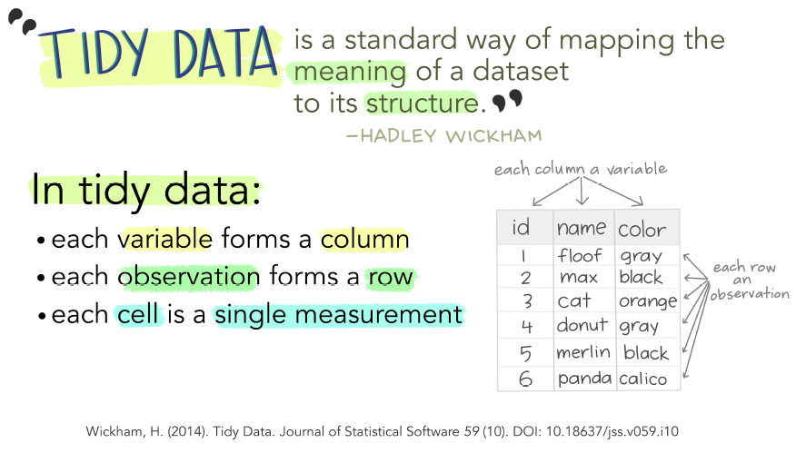

```{r setup, include=FALSE}
knitr::opts_chunk$set(echo = TRUE, warning = F,message = F,error = F)
library(tidyverse)
df_gap <- read.csv("data/gapminder.csv")

## prepare data for demonstrations

# Create data frame
dat <- data.frame(
  name = c("Alice", "Bob", "Charlie", "Dave", "Eve","Marta"),
  age = c(20, 30, NA, 28, 22, 21),
  gender = c("F", "M", "M", "M", "F", "F"),
  score = c(85, 62, 75, 80, 95, NA)
)


gdp_iqr <- quantile(df_gap$gdpPercap)
gdp_iqr_l <- quantile(log(df_gap$gdpPercap))


set.seed(1234)
grades <- round(rnorm(400, mean=80, sd=10))
df <- data.frame(grades = ifelse(grades >= 100, 100, grades))

x_iqr <- quantile(df$grades)

df$groups <- case_when(df$grades <= 70 ~ "0-70",
                       df$grades > 70 & df$grades <= 90 ~ "71-90",
                       df$grades > 90 ~ "91-100")

# data for abser R visualizaitons

mtcars <- mtcars


```


# Module II

- This module will equip students with essential data science skills in `R`.

- In the next quiz sections, we will cover the following topics:

  - **Data frames**, **logical** relations, and **subsetting.**
  
  - **Quantile** and `NA` data.
  
  - **Pivoting** and **merging** data.
  
  - Introduction to `ggplot2`.
  
  

# Creating and manipulating `data frames.`


- Think about *data* in terms of **data** *frame*.

```{r, echo=FALSE, out.width="100%", fig.align='center'}

```


# Creating and manipulating `data frames.`

- A data frame is a special type of object in R that can store **multiple vectors** of data.

- We can create data frames using the function `data.frame()`.


\footnotesize
```{r}
# vectors with student's names and grades
student <- c("Alice", "Bob", "Charlie","Sean","Brandy")
grades_M <- c(76, 82, 94, 45, 75)
grades_F <- c(82, 90, 89, NA, 64)

# create a df with grades
(df_new <- data.frame(student,grades_M,grades_F))
class(df_new)
class(student)
class(grades_M)
```


# Creating and manipulating `data frames.`


- We can create data frames by directly writing the vectors/columns as separate elements within the `data.frame()` function:


\footnotesize
```{r}

df_new <- data.frame(student=c("Alice", "Bob", "Charlie",
                            "Sean","Brandy"),
                     grades_M=c(76, 82, 94, 45, 75),
                     grades_F=c(82, 90, 89, NA, 64))

df_new
```


# Creating and manipulating `data frames.`

- To select a specific column from a data frame, use the `$` operator followed by the *name* of the column.

```{r}
df_new$grades_M
```


- To select specific rows and/or columns from a data frame, we use brackets `[]`.


- If the object is a single vector, we use a single numeric value in the brackets to select an element within the vector.


\small
```{r}
# select element 2 from vector grade_M:
df_new$grades_M[2]
```


# Creating and manipulating `data frames.`

- If the object is a matrix or data frame, we can select elements by their row and column positions.

  - **Note**: we input two different values separated by a **comma** to select the row and column 
  
\small
```{r}
# select row 2 from object df:
df_new[2,]

# select column 2 from object df:
df_new[,2]

# select element in row 2 and column 2:
df_new[2,2]
```
  

# Creating and manipulating `data frames.`


- We can also use **characters** to select columns by their names, for example:

\footnotesize
```{r}
# select column name "grade_M" from object df:

df_new[,"grades_M"]

# select columns name "student" and "grade_M":

df_new[,c("student","grades_M")]

```


# `tibbles` are `data frames` too!

- Another type of data frame are **tibbles**.
  - `tibble()` is a fancy version of `data.frame()`.
  - All `dplyr` functions provide outputs `as_tibbles`.

\small
```{r}
as_tibble(df_new) ; class(as_tibble(df_new))
df_new_tibble <- as_tibble(df_new)
```


# Logical relations


- **Logical Data Class:**
  - Represents binary values: `TRUE` or `FALSE`.
  - Can be transformed into numeric form: `TRUE` becomes 1, and `FALSE` becomes 0.
  - Useful for relational analyses and evaluating proportions of `TRUE` within a vector using the `mean()` function.
  - Used to set **conditional tests**; useful for **subsetting** or create new variables.

```{r}
3 + 5 < 10 # is 3 + 5 less than 10?
```


# Logical relations

\small
```{r}
# select column name "grade_M" from object df:
df_new$grades_M

# Is each value greater or equal to 80?
df_new$grades_M >= 80 # the condition ">= 80" sets a logical test

sum(df_new$grades_M >= 80)

# What proportion of TRUEs are in this vector?
mean(df_new$grades_M >= 80) # `TRUE` == 1, and `FALSE` == 0

```


# **Subsetting**: `ifelse()`.

- We can use the `ifelse()` function to create new variables based on *conditions* from other variables.

  1 - We set a *logical test* that evaluates to `TRUE` or `FALSE`.

  2 - We specify what value to assign if the test is `TRUE`, and a different value if the test is `FALSE`.

  
\small
```{r}
# if test is TRUE, then "pass", otherwise, then "fail"
df_new$midterm <- ifelse(df_new$grades_M > 60, "pass", "fail")

df_new

```


# **Subsetting**: Base `R`.


- We can use *logical tests* in **vectors** within the **row element** of an object `x[ test , ]` to subset those cases that are `TRUE`.

\scriptsize
```{r}
df_new[c(1,2,3,5),]

# In the vector midterm, what values are "pass"?
df_new$midterm=="pass"

# subset those rows where this test is TRUE
df_new[ df_new$midterm=="pass" , ]
```


# **Subsetting**: `subset()`/`filter()`.

- To subset data, we can use the functions `subset()` or `filter()`.

  - The `subset()` function is part of base R, while `filter()` is a function from the `dplyr` package. 

  - If you plan to use `filter()`, you need to load the `tidyverse` or `dplyr` package first.


\scriptsize
```{r}
# subset the df into a new one with final exam grades of above 85

df_new[ df_new$midterm=="pass" , ]
subset(df_new, midterm=="pass")

subset(df_new, grades_F > 85)

filter(df_new, grades_F > 85) # from dplyr package

```


# Processing `NA` data.

- An initial step in data science project analysis is to examine the `NA` values.


```{r}
dat

```

# Processing `NA` data.

- The function `is.na()` will return a vector of logical values


```{r}
is.na(dat)

mean(is.na(dat))
```


# Processing `NA` data.

- Several packages have functions to assists the analysis of `NA` values.

  - function `freq.na()` from package `questionr` is an example:


```{r}
library(questionr)
freq.na(dat)
```


# Processing `NA` data.

- We already know that some functions have the argument `na.rm`, but this is not the norm.

```{r}
dat$score
mean(dat$score)
mean(dat$score, na.rm = TRUE)
```


# Processing `NA` data.

- The `na.omit()` function in base R removes all rows with any NA value.

\small
```{r}
dat
na.omit(dat)
```


# Processing `NA` data.

- The `drop_na()` function from `dplyr` removes all rows with any NA value of a specific column.

\scriptsize
```{r}
drop_na(dat, score)
drop_na(dat, age)
```


# Processing `NA` data.

- We can use `ifelse()` function to substitute `NA` values.

\small
```{r}
dat$score <- ifelse( is.na( dat$score ), 
                     0, # if TRUE
                     dat$score) # if FALSE

dat
```


# Distributions


 - A **distribution** describes how variable values are **spread across** possible outcomes.
    - A **probability** distribution represents the **likelihood** of specific outcomes.
    - A **frequency** distribution summarizes counts of **distinct** values or ranges in dataset.
 - **Continuous vs. Discrete Distributions:**
    - **Continuous** distributions involve numerical variables that can take any value within a range (e.g., height, weight), while 
    - **Discrete** distributions involve variables that take distinct, separate values (e.g., number of cars, number of people).


# Continuous vs. Discrete Distributions

::: columns
:::: column
\scriptsize
```{r, echo=F}
hist(df$grades, probability = TRUE, col = "white", breaks = 60,
     main = "Distribution of Grades",
     xlab = "Course grades",
     cex.lab = 2.5,
     cex.main = 2.5,
     cex.axis = 2.5)
lines(density(df$grades), col = "red", lwd = 2)
```
::::
:::: column
```{r, echo=F}
barplot(tapply(df$grades,df$groups,function(x) length(x) / length(df$grades)),
        main = "Groups of grades", 
        xlab="Groups",
        ylab="Frequency",
        cex.names = 3,
        cex.lab = 2.5,
        cex.main = 2.5)
```
::::
:::


# Data Generating Process

- A **Data Generating Process** (DGP) refers to the hypothetical or real mechanism that generates a dataset.

  - It is a conceptual model that describes **how** the observed data is generated or produced.

- **Distributions** represent **systematic behavior** (aka, DGP).

- When looking at a distributions: 
    - think in terms of a **DGP**, and 
    - **how** the data was generated.


# Data Generating Process

- Two very useful pieces of information from a DGP are its **mean** and **standard deviation**.


$$ \bar{X} = \frac{1}{n} \sum_{i=1}^{n} X_i \quad ; \quad S = \sqrt{\frac{1}{n-1} \sum_{i=1}^{n} (X_i - \bar{X})^2} $$

where

  - $\bar{X}$ represents the **sample mean**.
  - $n$ is the number of **observations** in the sample.
  - $X_i$ represents **values** from a variable in the sample.
  - $S$ represents the **sample standard deviation**.


# Data Generating Process: standard deviation

- The **standard deviation** gives us information about how spread is the data around the mean.


::: columns
:::: column
\scriptsize
```{r, echo=F}
hist(rnorm(400, mean=80, sd=8), probability = TRUE, col = "white", breaks = 60,
     main = "Distribution of Grades of Section AW",
     xlab = "Course grades",
     xlim = c(60, 100),
     cex.lab = 2.5,
     cex.main = 2.5,
     cex.axis = 2.5)
```
::::
:::: column
```{r, echo=F}
hist(rnorm(400, mean=80, sd=4), probability = TRUE, col = "white", breaks = 60,
     main = "Distribution of Grades of Section AZ",
     xlab = "Course grades",
     xlim = c(60, 100),
     cex.lab = 2.5,
     cex.main = 2.5,
     cex.axis = 2.5)
```
::::
:::


# Reporting distributions

- When analyzing data, always report **descriptive statistics**.
  - *Mean.*
  - *Median.*
  - *Standard deviation.*
  - *Minimum.*
  - *Maximum.*
  - *Quartiles.*
  
- Note:
    - When comparing distributions of the same quantities, use the **median** instead of the **mean** as the reference point. **Why?**

# `quantile` and data distribution.

- The `quantile` function in `R` can be used to calculate the values that separate a distribution into different quantiles.

\small
```{r}
quantile(df$grades)
quantile(df$grades, probs = c(0.25, 0.5, 0.75))
summary(df$grades)
```


# `quantile` and data distribution.

- Visualizing quantiles.
- Use the argument `probs` to specify segments of the data.

```{r,echo=FALSE, fig.width=8,fig.height=4}

# create a histogram of the data

ggplot(data=df,aes(x = grades)) +
  geom_density(fill="lightskyblue",alpha=0.4) +
  labs(x = "Course grades",y="Density") +
  theme_void() +
  theme(axis.text.y = element_blank(), 
        axis.ticks.y = element_blank(),
        axis.text.x = element_text(size = 12, face = "bold"),
        axis.title.x = element_text(size = 14, face = "bold"))

```


# `quantile` and data distribution.

- Visualizing quantiles: **minimum**.

- `quantile(df$x, probs = 0)`

```{r,echo=FALSE, fig.width=8,fig.height=4}

# create a histogram of the data


ggplot(data=df,aes(x = grades)) +
  geom_density(fill="lightskyblue",alpha=0.4) +
  labs(x = "Course grades",y="Density") +
  theme_void() +
  theme(axis.text.y = element_blank(), 
        axis.ticks.y = element_blank(),
        axis.text.x = element_text(size = 12, face = "bold"),
        axis.title.x = element_text(size = 14, face = "bold")) +
  geom_vline(xintercept = min(df$grades), 
             color="brown",
             size=1,
             linetype="dashed")

```


# `quantile` and data distribution.

- Visualizing quantiles: **1st Quartile (Q1)** or **25th Percentile**.

- `quantile(df$x, probs = 0.25)`

```{r,echo=FALSE, fig.width=8,fig.height=4}

# create a histogram of the data

ggplot(data=df,aes(x = grades)) +
  geom_density(fill="lightskyblue",alpha=0.4) +
  labs(x = "Course grades",y="Density") +
  theme_void() +
  theme(axis.text.y = element_blank(), 
        axis.ticks.y = element_blank(),
        axis.text.x = element_text(size = 12, face = "bold"),
        axis.title.x = element_text(size = 14, face = "bold")) +
  geom_vline(xintercept = x_iqr[2], 
             color="blue",
             size=1,
             linetype="dashed")

```


# `quantile` and data distribution.

- Visualizing quantiles: **2st Quartile (Q2)** or **50th Percentile** or **median** or **5th Decile**.

- `quantile(df$x, probs = 0.5)`

```{r,echo=FALSE, fig.width=8,fig.height=4}

# create a histogram of the data

ggplot(data=df,aes(x = grades)) +
  geom_density(fill="lightskyblue",alpha=0.4) +
  labs(x = "Course grades",y="Density") +
  theme_void() +
  theme(axis.text.y = element_blank(), 
        axis.ticks.y = element_blank(),
        axis.text.x = element_text(size = 12, face = "bold"),
        axis.title.x = element_text(size = 14, face = "bold")) +
  geom_vline(xintercept = x_iqr[3], 
             color="red",
             size=1,
             linetype="dashed")

```


# `quantile` and data distribution.

- Visualizing quantiles: **3st Quartile (Q3)** or **75th Percentile**.

- `quantile(df$x, probs = 0.75)`

```{r,echo=FALSE, fig.width=8,fig.height=4}

# create a histogram of the data

ggplot(data=df,aes(x = grades)) +
  geom_density(fill="lightskyblue",alpha=0.4) +
  labs(x = "Course grades",y="Density") +
  theme_void() +
  theme(axis.text.y = element_blank(), 
        axis.ticks.y = element_blank(),
        axis.text.x = element_text(size = 12, face = "bold"),
        axis.title.x = element_text(size = 14, face = "bold")) +
  geom_vline(xintercept = x_iqr[4], 
             color="darkgreen",
             size=1,
             linetype="dashed")

```


# `quantile` and data distribution.

- Visualizaing quantiles: **maximum** or **100th percentile** or **10th decile**.

- `quantile(df$x, probs = 1)`

```{r,echo=FALSE, fig.width=8,fig.height=4}

# create a histogram of the data

ggplot(data=df,aes(x = grades)) +
  geom_density(fill="lightskyblue",alpha=0.4) +
  labs(x = "Course grades",y="Density") +
  theme_void() +
  theme(axis.text.y = element_blank(), 
        axis.ticks.y = element_blank(),
        axis.text.x = element_text(size = 12, face = "bold"),
        axis.title.x = element_text(size = 14, face = "bold")) +
  geom_vline(xintercept = max(df$grades), 
             color="brown",
             size=1,
             linetype="dashed")

```


# `quantile` and data distribution.

- Visualizing quantiles: **deciles** (1-10).

- `quantile(df$x, probs = seq(from=0,to=1,by=0.1))`

```{r,echo=FALSE, fig.width=8,fig.height=4}

# create a histogram of the data

ggplot(data=df,aes(x = grades)) +
  geom_density(fill="lightskyblue",alpha=0.4) +
  labs(x = "Course grades",y="Density") +
  theme_void() +
  theme(axis.text.y = element_blank(), 
        axis.ticks.y = element_blank(),
        axis.text.x = element_text(size = 12, face = "bold"),
        axis.title.x = element_text(size = 14, face = "bold")) +
  geom_vline(xintercept = quantile(df$grades,probs = seq(from=0,to=1,by=0.1)), 
             color="blue",
             size=1,
             linetype="dashed") +
  annotate(
    "text",
    x = quantile(df$grades, probs = seq(from = 0.1, to = 1, by = 0.1)),
    y = 0.035,
    label = c("D1", "D2", "D3", "D4", "D5", "D6", "D7", "D8", "D9", "D10"),
    color = "red",
    size = 5,
    fontface = "bold",
    vjust = 1.5,
    hjust = 1.5
  )


```


# `quantile` and data distribution.

- Visualizing quantiles: **percentiles** (1-100).

- `quantile(df$x, probs = seq(from=0,to=1,by=0.01))`

```{r,echo=FALSE, fig.width=8,fig.height=4}

# create a histogram of the data

ggplot(data=df,aes(x = grades)) +
  geom_density(fill="lightskyblue",alpha=0.4) +
  labs(x = "Course grades",y="Density") +
  theme_void() +
  theme(axis.text.y = element_blank(), 
        axis.ticks.y = element_blank(),
        axis.text.x = element_text(size = 12, face = "bold"),
        axis.title.x = element_text(size = 14, face = "bold")) +
  geom_vline(xintercept = quantile(df$grades,probs = seq(from=0,to=1,by=0.01)), 
             color="red",
             size=0.5,
             linetype="dashed")


```


# `quantile` and data distribution.

- The **interquartile range** (IQR) is a measure of variability that represents the difference between the **first** and the **third** quartiles. 

- It provides information about the spread of the middle 50% of the data.

```{r,echo=FALSE, fig.width=8,fig.height=4}

# create a histogram of the data


ggplot(data=df,aes(x = grades)) +
  geom_density() +
  labs(x = "Course grades",y="Density") +
  theme_void() +
  theme(axis.text.y = element_blank(), 
        axis.ticks.y = element_blank(),
        axis.text.x = element_text(size = 12, face = "bold"),
        axis.title.x = element_text(size = 14, face = "bold")) +
  annotate("rect", 
           xmin = x_iqr[2], xmax = x_iqr[4], 
           ymin = -Inf, ymax = Inf, 
           fill = "blue", alpha = 0.3) +
  geom_vline(xintercept = c(min(df$grades),max(df$grades)), 
             color="brown",
             size=1,
             linetype="dashed") +
  geom_vline(xintercept = x_iqr[2], 
             color="blue",
             size=1,
             linetype="dashed") +
  geom_vline(xintercept = x_iqr[3], 
             color="red",
             size=1,
             linetype="dashed") +
  geom_vline(xintercept = x_iqr[4], 
             color="darkgreen",
             size=1,
             linetype="dashed") +
  theme(axis.text.y = element_blank(), 
        axis.ticks.y = element_blank(),
        axis.text.x = element_text(size = 12, face = "bold"),
        axis.title.x = element_text(size = 14, face = "bold"))

```


# **More functions**: nested `ifelse`.

- To create a new discrete variable, *letter*, with three levels (C, B, and A) based on exam scores, consider using `ifelse`. 


```{r}
dat$letter <- ifelse(dat$score < 70, 
                     "C", # if TRUE
                     "Otherwise") # if FALSE
dat
```


#  **More functions**: nested `ifelse`.

- However, note that `ifelse` yields binary results determined by the conditional test's `TRUE` or `FALSE`.


```{r}
dat$letter <- ifelse(dat$score >= 70 & dat$score < 85, 
                     "B", # if TRUE
                     "Otherwise") # if FALSE
dat
```


#  **More functions**: nested `ifelse`.

- Can we do better and use `ifelse` to map several characters into a vector using conditional tests?


```{r}
dat$letter <- ifelse(dat$score >= 85, 
                     "A", # if TRUE
                     "Otherwise") # if FALSE
dat
```


#  **More functions**: nested `ifelse`.

- Yes! `ifelse` function can be nested on itself for multiple tests.

\scriptsize
```{r}
dat$letter <- ifelse(dat$score < 70, 
                     "C", # if TRUE
                     ifelse(dat$score >= 70 & dat$score < 85, # if FALSE
                                "B", # if TRUE
                            ifelse(dat$score >= 85, # if FALSE
                                           "A",  # if TRUE
                                   NA))) # if FALSE
dat
```


#  **More functions**: nested `case_when`.

- You can use the `case_when` function from the `dplyr` package to produce the same output.

\small
```{r}
dat$letter <- case_when(dat$score < 70 ~ "C",
                        dat$score >= 70 & dat$score < 85 ~ "B",
                        dat$score >= 85 ~ "A")
dat
```


# Data class: factors

 - **Categorical variables** can take on a limited, and usually fixed, number of different values or levels.
 
    - Voted:
        - Yes/No
    - Political parties:
        - Social democrat, Liberals, Conservatives, Green party, etc
    - *Likert scales* in survey opinions:
        - Strongly Agree, Agree, Disagree, Strongly Disagree

- However, `character` data type in R is used to store sequences of characters (text).

# Factors

 - A factor is a data structure used to represent categorical variables.


```{r}
gender <- c("Male", "Female", "Male", "Female")

class(gender)

gender_factor <- as.factor(gender)

class(gender_factor)

```


# Factors: levels

 - Factors have levels, which are the distinct values that the categorical variable can take.

 - The levels are determined by the unique values in the original vector.

```{r}
# Checking levels of a factor
levels(gender_factor)
```


# Factors: Ordering Levels

By default, levels are ordered alphabetically. You can customize the order using the levels argument.

```{r}
# Example: Specifying custom order
(ordered_gender <- factor(gender, 
                          levels = c("Male", "Female")))

# Checking the levels of a facto variable
levels(ordered_gender)
```


# Good practice: create factor variables

- Some functions, especially in ggplot2 for visualization, require factors to function properly.
- It is a good practice to create new variables as **factors** when initiating an analysis.

\small
```{r}
(female <- c(0,1,0,1,0,0))

(female_f <- factor(female, 
                   levels = c(0,1), # map the levels order
                   labels = c("male","female")))
```


# Grammar of graphics

- A statistical graphic is a **`mapping`** of **`data`** variables to **`aes`**thetic attributes of **`geom`**etric objects. ([Wilkinson 2005](https://info5940.infosci.cornell.edu/notes/dataviz/grammar-of-graphics/))


```{r, echo=FALSE, out.width="65%", fig.align='center'}
knitr::include_graphics("images/gglayers.PNG")
```


# Grammar of graphics in `ggplot2`

- `ggplot2`: A *layered* grammer of graphics ([Wickham 2009](https://ggplot2-book.org/)).

  - Build a graphic from multiple layers; each consists of some geometric objects or transformation 
  
  - Use `+` to stack up layers
  


- *What* data do you want to visualize?
  - **`ggplot(data = ...)`**


- *How* are variables mapped to specific aesthetic attributes?
  - **`aes(... = ...)`**
    - positions (`x`, `y`), `shape`, `colour`, `size`, `fill`, `alpha`, `linetype`, `label`...
    - If the value of an attribute do not vary w.r.t. some variable, don't wrap it within `aes(...)`


- *Which* geometric shapes do you use to represent the data?
  - **`geom_{}`**:
    - `geom_point`, `geom_line`, `geom_ribbon`, `geom_polygon`, `geom_label`...


# Tidy data

- `ggplot2` works well only with tidy data
    - *Tidy data*:
        - Each **variable** must have its own **column**
        - Each **observation** must have its own **row**
        - Each value must have its own cell

# Intro to ggplot


- How to create a **scatter plot**: *continuous* vs. *continuous* variables

- How to create a **boxplot**: *continuous* vs **categorical** variables

```{r}
summary(mtcars[,c("mpg","wt","cyl")])
```


# Building a plot from scratch

::: columns
:::: column
Step 1: Define a basic ggplot object with x and y aesthetics
\scriptsize
```{r, eval=F}
library(ggplot2)

ggplot(data=mtcars,
       aes(x=mpg,
           y=wt))
```
::::
:::: column
```{r, echo=F}
ggplot(data=mtcars,
       aes(x=mpg,
           y=wt))
```
::::
:::

# Building a plot from scratch: scatter plot

::: columns
:::: column
Step 2: Define a geometric shape
\scriptsize
```{r, eval=F}
ggplot(data=mtcars,
       aes(x=mpg,
           y=wt)) +
  geom_point()
```
::::
:::: column
```{r, echo=F}
ggplot(data=mtcars,
       aes(x=mpg,
           y=wt)) +
  geom_point()
```
::::
:::


# Building a plot from scratch: scatter plot

::: columns
:::: column
**Note**: we are not limited to have a single geometric form,
\scriptsize
```{r, eval=F}
ggplot(data=mtcars,
       aes(x=mpg,
           y=wt)) +
  geom_point() +
  geom_smooth(span=2)
```
::::
:::: column
```{r, echo=F}
ggplot(data=mtcars,
       aes(x=mpg,
           y=wt)) +
  geom_point() +
  geom_smooth()
```
::::
:::


# Building a plot from scratch: scatter plot

::: columns
:::: column
**Note**: we are not limited to have a single geometric form,
\scriptsize
```{r, eval=F}
ggplot(data=mtcars,
       aes(x=mpg,
           y=wt)) +
  geom_point() +
  geom_smooth()
```
::::
:::: column
```{r, echo=F}
ggplot(data=mtcars,
       aes(x=mpg,
           y=wt)) +
  geom_point() +
  geom_smooth()
```
::::
:::


# Building a plot from scratch: boxplot

::: columns
:::: column
**Note**: we are not limited to have a single geometric form,
\scriptsize
```{r, eval=F}
ggplot(data=mtcars,
       aes(x=factor(cyl),
           y=wt)) +
  geom_boxplot()
```
::::
:::: column
```{r, echo=F}
ggplot(data=mtcars,
       aes(x=factor(cyl),
           y=wt)) +
  geom_boxplot()
```
::::
:::


# More on `ggplot`: **colors**


- In `ggplot`, the **color** `aes`thetic is used to group data by a categorical or numerical variable, with each group automatically assigned a unique color.

- Customize the color aesthetic using the argument in a `geom` shape, you cannot manually fit **colors** in the `aes()` function because ggplot will assume that you are fiting a **factor variable**.

- Use the `scale_color_manual()` function to set specific colors for values in a plot by passing a named vector of colors to the values argument.

- You can create your own custom color palette with the `scale_color_manual()` function by specifying a named vector of colors.


# More on `ggplot`: **colors**

- Why the following plot is not blue?


::: columns
:::: column
\scriptsize
```{r, eval=F}
ggplot(mtcars, aes(x = wt, 
                   y = mpg, 
                   color="blue")) +
  geom_point()

```
::::
:::: column
\scriptsize
```{r, echo=F}
ggplot(mtcars, aes(x = wt, 
                   y = mpg, 
                   color="blue")) +
  geom_point()

```
::::
:::


# More on `ggplot`: **colors**

- Customize the color aesthetic using the argument in a `geom` shape, you cannot manually fit **colors** in the `aes()` function because ggplot will assume that you are fiting a **factor variable**.


::: columns
:::: column
\scriptsize
```{r, eval=F}
ggplot(mtcars, aes(x = wt, 
                   y = mpg)) +
  geom_point(color = "blue")
```
::::
:::: column
\scriptsize
```{r, echo=F}
ggplot(mtcars, aes(x = wt, 
                   y = mpg)) +
  geom_point(color = "blue")
```
::::
:::


# More on `ggplot`: **colors**


::: columns
:::: column
\scriptsize
```{r, eval=F}
ggplot(mtcars, aes(x = wt, 
                   y = mpg)) +
  geom_point(aes(color=factor(cyl)))
```
::::
:::: column
\scriptsize
```{r, echo=F}
ggplot(mtcars, aes(x = wt, 
                   y = mpg, 
                   color = factor(cyl))) +
  geom_point()
```
::::
:::


# More on `ggplot`: **colors**

- Built-in ggplot color **palettes** can be used by passing the name of the palette to the palette argument of the `scale_color_()` function. For instance, `scale_color_brewer()` can be used to apply a palette from the **ColorBrewer library**.


::: columns
:::: column
\scriptsize
```{r, eval=F}
library(RColorBrewer)

my_colors <- brewer.pal(4, "Blues")[2:4]

ggplot(mtcars, aes(x = wt, 
                   y = mpg, 
                   color = factor(cyl))) +
  geom_point() +
  scale_fill_manual(values = my_colors, aes(factor(cyl)))
  #scale_color_brewer(palette = "Set2")
```
::::
:::: column
\scriptsize
```{r, echo=F}
library(RColorBrewer)

ggplot(mtcars, aes(x = wt, 
                   y = mpg, 
                   color = factor(cyl))) +
  geom_point() +
  scale_color_brewer(palette = "Set2")
```
::::
:::


# More on `ggplot`: **colors**

- You can customize which elements shall be colored using `filter`


::: columns
:::: column
\scriptsize
```{r, eval=F}
ggplot(mtcars, aes(x = wt, 
                   y = mpg)) +
  geom_point(color = 
               ifelse(mtcars$mpg > 20,
                      "blue", "red"))
```
::::
:::: column
\scriptsize
```{r, echo=F}
ggplot(mtcars, aes(x = wt, 
                   y = mpg)) +
  geom_point(color = ifelse(mtcars$mpg > 20, 
                            "blue", "red"))
```
::::
:::


# More on `ggplot`: **colors**

- You can also fit numerical variables or manually sacle the gradient between several colors.


::: columns
:::: column
\scriptsize
```{r, eval=F}
ggplot(mtcars, aes(x = wt, 
                   y = mpg, 
                   color = hp)) +
  geom_point() +
  scale_color_gradient(low = "blue", 
                       high = "red")

```
::::
:::: column
\scriptsize
```{r, echo=F}
ggplot(mtcars, aes(x = wt, 
                   y = mpg, 
                   color = wt)) +
  geom_point() +
  scale_color_gradient(low = "blue", 
                       high = "red")

```
::::
:::


# More on `ggplot`: **histograms**

- When defining histograms or barplots, you only need to define the x aesthetics as y becomes the relative or absolute frequencies


::: columns
:::: column
\scriptsize
```{r, eval=F}
ggplot(mtcars, 
       aes(x = mpg)) +
  geom_histogram()

```
::::
:::: column
\scriptsize
```{r, echo=F}
ggplot(mtcars, 
       aes(x = mpg)) +
  geom_histogram()

```
::::
:::


# More on `ggplot`: **histograms**

- To color geometries with large areas, you will need to use the `fill=` argument.

::: columns
:::: column
\scriptsize
```{r, eval=F}
ggplot(mtcars, 
       aes(x = mpg)) +
  geom_histogram(fill="steelblue1")

```
::::
:::: column
\scriptsize
```{r, echo=F}
ggplot(mtcars, 
       aes(x = mpg)) +
  geom_histogram(fill="steelblue1")

```
::::
:::


# More on `ggplot`: **histograms**

- The argument color will provide color in the surface of the geometry.


::: columns
:::: column
\scriptsize
```{r, eval=F}
ggplot(mtcars, 
       aes(x = mpg)) +
  geom_histogram(fill="steelblue1",
                 color="blue")

```
::::
:::: column
\scriptsize
```{r, echo=F}
ggplot(mtcars, 
       aes(x = mpg)) +
  geom_histogram(fill="steelblue1",
                 color="red")

```
::::
:::


# More on `ggplot`: **density plots**

- For a density plots, use `geom_density`.


::: columns
:::: column
\scriptsize
```{r, eval=F}
ggplot(mtcars, 
       aes(x = mpg)) +
  geom_density()

```
::::
:::: column
\scriptsize
```{r, echo=F}
ggplot(mtcars, 
       aes(x = mpg)) +
  geom_density()

```
::::
:::


# More on `ggplot`: **density plots**

- For a density plots, use `geom_density`.

::: columns
:::: column
\scriptsize
```{r, eval=F}
ggplot(mtcars, 
       aes(x = mpg)) +
  geom_density(fill="steelblue1")

```
::::
:::: column
\scriptsize
```{r, echo=F}
ggplot(mtcars, 
       aes(x = mpg)) +
  geom_density(fill="steelblue1")

```
::::
:::


# More on `ggplot`: **density plots**

- Geometric shapes have `alpha=` which controls the transparency of the geometry.
  - `alpha` values range from 0 (transparent) to 1 (opaque).

::: columns
:::: column
\scriptsize
```{r, eval=F}
ggplot(mtcars, 
       aes(x = mpg)) +
  geom_density(fill="steelblue1",
               alpha=0.5)

```
::::
:::: column
\scriptsize
```{r, echo=F}
ggplot(mtcars, 
       aes(x = mpg)) +
  geom_density(fill="steelblue1",
               alpha=0.5)

```
::::
:::


# More on `ggplot`: **density plots**

- You can use the geometry `geom_vline` to include vertical lines and highlight points or thresholds of interest, like the `mean`

::: columns
:::: column
\scriptsize
```{r, eval=F}
ggplot(mtcars, 
       aes(x = mpg)) +
  geom_density(fill="steelblue1",
               alpha=0.5) +
  geom_vline(xintercept = mean(mtcars$mpg), linetype=1, color="red")

```
::::
:::: column
\scriptsize
```{r, echo=F}
ggplot(mtcars, 
       aes(x = mpg)) +
  geom_density(fill="steelblue1",
               alpha=0.5) +
  geom_vline(xintercept = mean(mtcars$mpg))

```
::::
:::


# More on `ggplot`: **density plots**

- The geometry `geom_vline` can be customized with `colors` and `linetype` arguments.

::: columns
:::: column
\scriptsize
```{r, eval=F}
ggplot(mtcars, 
       aes(x = mpg)) +
  geom_density(fill="steelblue1",
               alpha=0.5) +
  geom_vline(xintercept = mean(mtcars$mpg),
             color="red",
             linetype="dashed")

```
::::
:::: column
\scriptsize
```{r, echo=F}
ggplot(mtcars, 
       aes(x = mpg)) +
  geom_density(fill="steelblue1",
               alpha=0.5) +
  geom_vline(xintercept = mean(mtcars$mpg),
             color="red",
             linetype="dashed")

```
::::
:::


# More on `ggplot`: **density plots**

- You can have multiple geometries at once.

::: columns
:::: column
\scriptsize
```{r, eval=F}
ggplot(mtcars, 
       aes(x = mpg)) +
        geom_density(fill="steelblue1",
               alpha=0.5) +
  geom_vline(xintercept = mean(mtcars$mpg),
             color="red",
             linetype="dashed") +
  geom_vline(xintercept = median(mtcars$mpg))


```
::::
:::: column
\scriptsize
```{r, echo=F}
ggplot(mtcars, 
       aes(x = mpg)) +
  geom_density(fill="steelblue1",
               alpha=0.5) +
  geom_vline(xintercept = mean(mtcars$mpg),
             color="red",
             linetype="dashed") +
  geom_vline(xintercept = median(mtcars$mpg)) 

```
::::
:::


# More on `ggplot`: **density plots**

- In the aesthetics, you can include an index factor to the `group=` argument to subset a geometry in different levels


::: columns
:::: column
\scriptsize
```{r, eval=F}
ggplot(mtcars, 
       aes(x = mpg,
           color=factor(cyl))) +
  geom_density()+
  xlab("MPG")

```
::::
:::: column
\scriptsize
```{r, echo=F}
ggplot(mtcars, 
       aes(x = mpg,
           group=factor(cyl))) +
  geom_density()

```
::::
:::


# More on `ggplot`: **density plots**

- When doing so, make sure to provide `color` to all the factor levels by setting fill or color arguments in the general aesthetics `aes()` argument.

::: columns
:::: column
\scriptsize
```{r, eval=F}
ggplot(mtcars, 
       aes(x = mpg,
           group=factor(cyl),
           fill=factor(cyl))) +
  geom_density(alpha=0.7)

```
::::
:::: column
\scriptsize
```{r, echo=F}
ggplot(mtcars, 
       aes(x = mpg,
           group=factor(cyl),
           fill=factor(cyl))) +
  geom_density(alpha=0.7)

```
::::
:::


# More on `ggplot`: **facets**

- When a group factor has many levels, is sometimes useful to split the plot in multiple facets using the geometries of `facet_wrap` or `facet_grid`.
  - Notice the syntax, requires a `~` before the factor.

::: columns
:::: column
\scriptsize
```{r, eval=F}
ggplot(mtcars, 
       aes(x = mpg,
           group=factor(cyl),
           fill=factor(cyl))) +
  geom_density(alpha=0.7) +
  facet_wrap( ~  factor(cyl))

```
::::
:::: column
\scriptsize
```{r, echo=F}
ggplot(mtcars, 
       aes(x = mpg,
           group=factor(cyl),
           fill=factor(cyl))) +
  geom_density(alpha=0.7) +
  facet_wrap( ~  factor(cyl))

```
::::
:::


# Grammar of graphics in `ggplot2`

- Browse the most common [named colors in R](https://evamaerey.github.io/ggplot2_grammar_guide/named_colors.html).

- `ggplot2` is a powerful tool for creating professional visualizations.

- Search on the internet or ask ChatGPT for help with specific plot types using keywords based on geometries, such as **line plots**, **histograms**, **boxplots**, **coefficient plots**, etc.


# Save your output with `ggsave`

- The ggsave function is used to save a ggplot object as a file. For example, if you save a plot as "myplot.pdf", the file format will be PDF.

- By default, ggsave will save the last plot created, but you can also specify a specific plot object to save.

- You can use the width and height arguments to adjust the size of the output file.

\scriptsize
```{r,eval=FALSE}
ggsave("output/gincdif_dis.pdf", width = 6, height = width/1.618)
```


# Merging datasets

- Merging two datasets is actually more complicated than you might think

```{r, echo=FALSE, out.width = "65%", fig.align = 'center'}
knitr::include_graphics("images/dplyr-joins.png")
```

# Merging datasets: key variables

\scriptsize
```{r}
polity <- read_csv("data/polity2.csv")
gapminder <- read_csv("data/gapminder2.csv")
names(gapminder)
names(polity)

# with dplyr, rename()
gapminder <- gapminder %>% rename(country=cntry)

# with base R, either colnames() or names()
colnames(gapminder)[1] <- "country"

names(gapminder)
```


# Merging datasets: base R

```{r}
dim(gapminder)
dim(polity)

merged_df <- merge(gapminder, polity, 
                      by = c("country", "year"))

nrow(merged_df)
```

# Merging datasets: dplyr

\scriptsize
```{r}
merged_data1 <- inner_join(gapminder, polity)
merged_data2 <- full_join(gapminder, polity)
merged_data3 <- left_join(gapminder, polity)
merged_data4 <- right_join(gapminder, polity)


nrow(merged_data1)
nrow(merged_data2)
nrow(merged_data3)
nrow(merged_data4)
```


# More functions


- The remaining slides feature useful functions for data management and exploratory analyses, provided for your personal reference.

- While not essential for completing the remaining problem sets in CS&SS 321, these functions can prove valuable for your final projects.


# `group_by()` w/ `summarize()` for summarizing data.

- So far we have been using `tapply()` from base R to *apply* a functions over variables and categories.

\scriptsize
```{r}
library(dplyr)
df <- read.csv("data/gapminder.csv")

head(df)
```

\pause

\scriptsize
```{r}
# what is the average income (gdpPercap) per continent?

tapply(df$gdpPercap,df$continent,FUN=mean)

```


# `group_by()` w/ `summarize()` for summarizing data.

- However, `tapply()` have some short comings:

  - `tapply()` returns output in a **tabular format**, but it is not in a `data.frame` or a tidy format, which can be inconvenient for further processing and analysis.
  
  - `tapply()` can only be used with **one variable** at a time, making it difficult to work with multiple variables or to create summaries of more than one variable.


# `group_by()` w/ `summarize()` for summarizing data.

 - `group_by()` w/ `summarize()` is used for performing grouped operations on data.
 - It allows you to split the data into groups based on one or more variables and apply a function to each group.
    
 - The basic syntax of `summarize()` is `summarize(.data, ..., .groups = NULL)`, where:
   - `.data`: The data frame or tibble to operate on.
   - `...`: Name-value pairs of summary functions to compute (e.g., `mean(x)`, `sum(y)`).


# `group_by()` w/ `summarize()` for summarizing data.

```{r}
gapminder_summary <- df %>%
  group_by(year) %>%
  summarise(mean_gdpPercap = mean(gdpPercap))
```

# `group_by()` w/ `summarize()` for summarizing data.

```{r}
gapminder_summary <- df %>%
  group_by(year) %>%
  summarise(
    across(c(gdpPercap, lifeExp, pop), mean,
           .names = "mean_{.col}")
  )
```


# `group_by()` w/ `summarize()` for summarizing data.

```{r}
gapminder_summary <- df %>%
  group_by(year) %>%
  summarise(
    across(c(gdpPercap, lifeExp, pop), mean,
           .names = "mean_{.col}"),
    median_lifeExp = median(lifeExp),
    total_pop = sum(pop)
  )
```

# **reshaping** data with `dplyr`

- **Reshaping** a data frame is a crucial skill in data science that enables you to perform various necessary tasks efficiently.

\vspace{2mm}

- There are two main types of data structures: **long** and **wide** formats.

\vspace{2mm}

  - **Long format** is the preferred structure for most R functions and packages, including ggplot2. It is **tidy data** that is easy to manipulate and analyze.
  
\vspace{2mm}
  
  - Although not tidy, **wide format** can be useful for presenting tables to audiences as it conveys more information in a smaller space. However, it is not ideal for data analysis.


# `long` vs `wide`


```{r, echo=FALSE, out.width="100%", fig.align='center'}
knitr::include_graphics("images/reshape.PNG")
```


# **reshaping** data with `dplyr`

- The `pivot_` functions allow you to **reshape** data frames from long to wide or vice versa, which can be useful for data wrangling and visualization purposes.


\small
```{r}

# Create example data
(df <- data.frame(
  id = c(1, 2, 3),
  treatment = c("A", "B", "C"),
  day1 = c(10, 15, 12),
  day2 = c(12, 16, 18),
  day3 = c(8, 14, 10)
))


```


# **reshaping** data with `dplyr`

- `pivot_longer()` is used to convert a wide data frame to a **long format** by stacking columns into rows. 

- You must specify which **columns** to pivot, the **names** for the new columns, and the name of the column to store the **values**.

::: columns
:::: column
\scriptsize
```{r, eval=F}
# Use pivot_longer() to reshape 
# the data from wide to long

df_long <- 
  pivot_longer(df,
               cols = starts_with("day"), 
               names_to = "day", 
               values_to = "result")
df_long
```
::::
:::: column
\scriptsize
```{r, echo=F}
# Use pivot_longer() to reshape the data from wide to long

df_long <- 
  pivot_longer(df,
               cols = starts_with("day"), 
               names_to = "day", 
               values_to = "result")
df_long
```
::::
:::

# **reshaping** data with `dplyr`

- while pivot_wider() does the opposite by spreading rows into columns.


pivot_wider() takes similar arguments, but also requires specifying which column to use for the column names and which column to use for the values in the new columns.


::: columns
:::: column
\scriptsize
```{r, eval=F}
# Use pivot_wider() to reshape 
# the data from long to wide

df_wide <- 
  pivot_wider(df_long,
              names_from = "day", 
              values_from = "result")
df_wide
```
::::
:::: column
\scriptsize
```{r, echo=F}

df_wide <- 
  pivot_wider(df_long,
              names_from = "day", 
              values_from = "result")
df_wide
```
::::
:::

# Function: `stargazer()`

- To present results from several linear models in a output table, use the function `stargazer()`.
    - In the `R`Markdown, you will need to set the code chunk option `results='asis'`

```{r}
library(stargazer)
m1 <- lm(mpg ~ hp, data=mtcars)
m2 <- lm(mpg ~ hp + cyl, data=mtcars)
```


# Function: `stargazer()`
\scriptsize
```{r,results='asis'}
stargazer(m1,m2,header = FALSE,type="latex") # type="text" for R console
```


