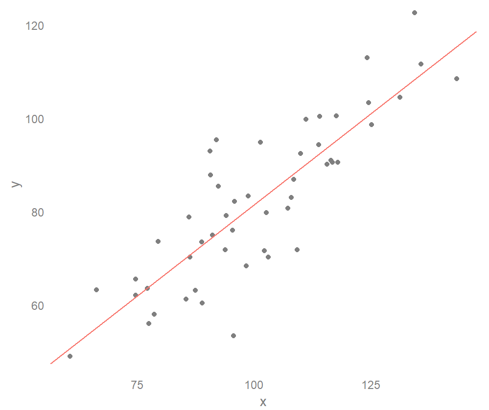
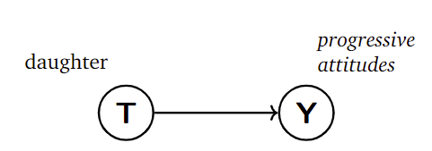
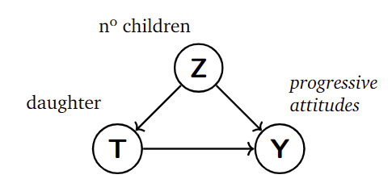
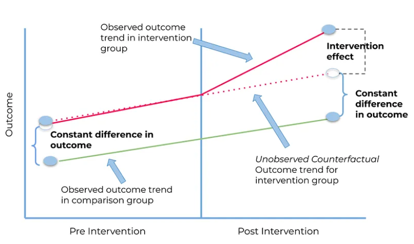
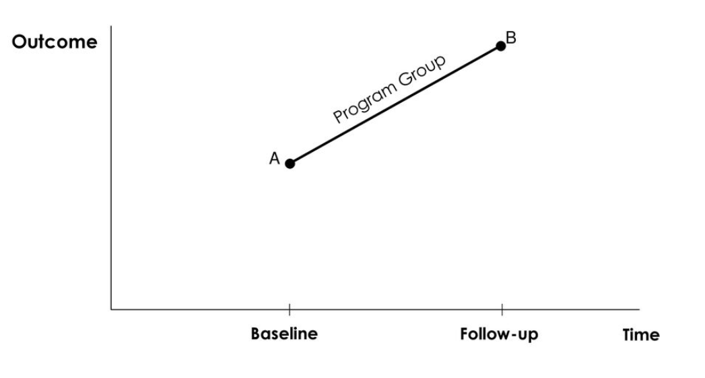
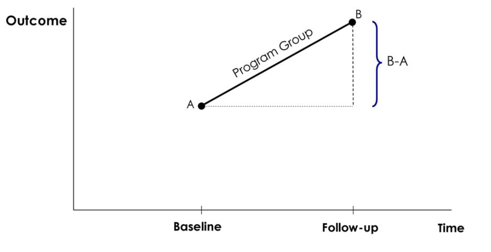
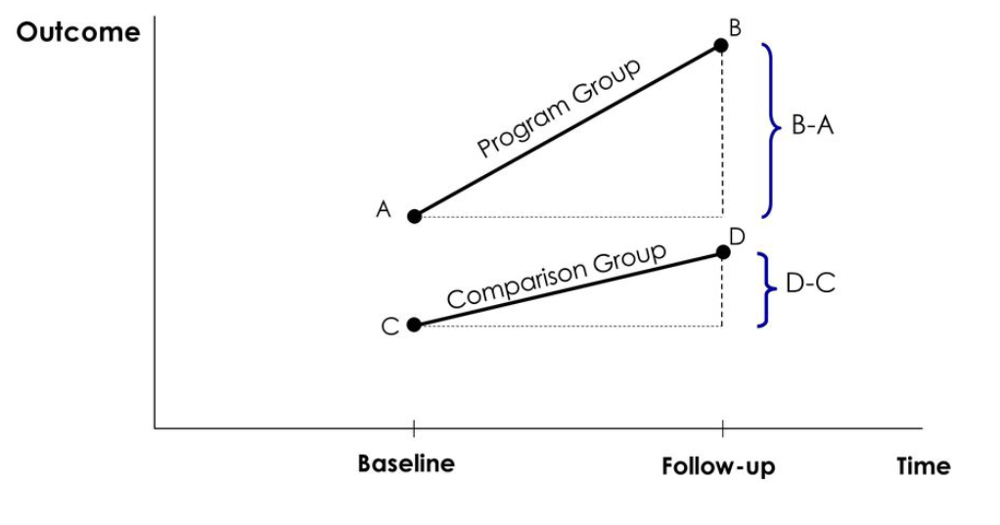
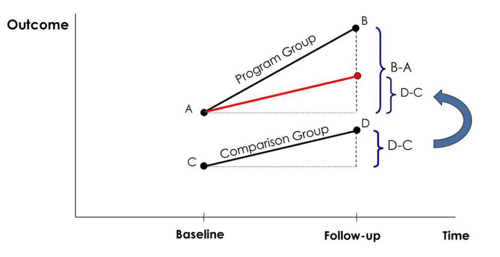
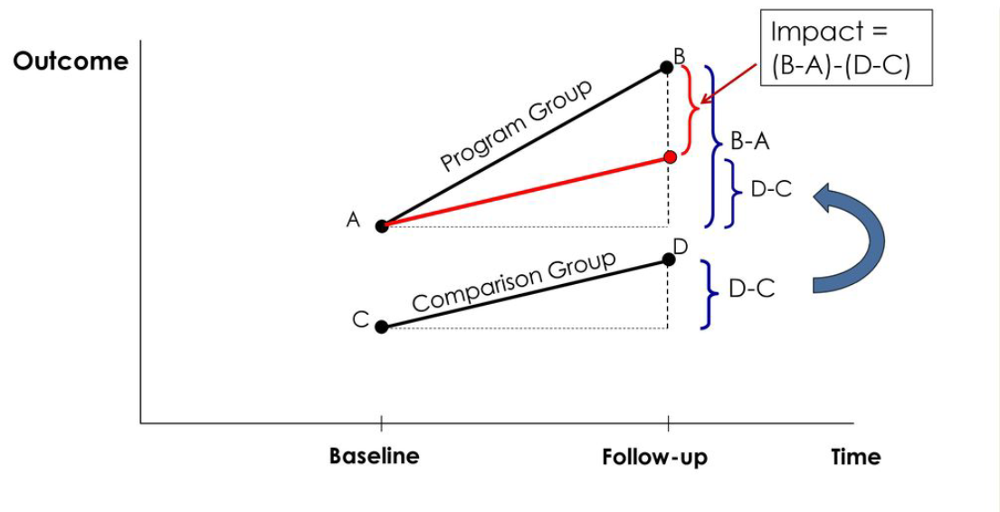

```{r setup, include=FALSE}
knitr::opts_chunk$set(echo = TRUE, warning = F,message = F,error = F)

rm(list=ls())

# load libraries
library(tidyverse)
library(ggpubr)     # for arranging plots together


theme_set(cowplot::theme_cowplot() + 
            theme(axis.text.x = element_text(size = 16, color = "black")))


set.seed(1234)


## data for mean population

df <-
  tibble(
    grades = round(c(rnorm(200, mean=70, sd=4),
                     rnorm(200, mean=80, sd=10),
                     rnorm(10000, mean=80, sd=4),
                     rnorm(10000, mean=80, sd=6))),
    data = c(rep("sample",400),rep("DGP/population",20000))
  ) %>% 
  mutate(
    grades = ifelse(grades >= 100, 100, grades)
  )


## data for unconditional and conditional distributions

df2 <-
  tibble(
    grades = round(c(rnorm(1000, mean=78, sd=3),
                     rnorm(1000, mean=82, sd=3),
                     rnorm(1000, mean=80, sd=3),
                     rnorm(1000, mean=84, sd=3))),
    group = c(rep("A",1000),rep("B",1000),
              rep("C",1000),rep("D",1000))
  ) %>% 
  mutate(
    grades = ifelse(grades >= 100, 100, grades),
    group = factor(group,
                   levels=c("A","B","C","D"),
                   ordered = TRUE)
  )


# label for DGP plot

dgp <- list(~"DGP",
           "u"~"= 80",
           sigma^2~"= 2")

# label for sample 1

samp1 <- list(~"Sample",
           bar(X)~"= 75",
           S^2~"= 4")

# plot of DGP grades

p1 <-
  df %>%
  filter(data == "DGP/population") %>% 
  ggplot(aes(x = grades)) +
  geom_histogram(aes(y = after_stat(density)), 
                 bins = 45, alpha = 0.05,
                 color = "blue",
                 fill = "steelblue1") +
  geom_density(color = "navy", linewidth = 1) +
  geom_vline(xintercept=mean(df$grades[df$data=="DGP/population"]),
             linetype = "dashed", color = "red", size=1) +
  annotate(geom="text", label = dgp,
           parse=TRUE, # argument to pass expressions in plotmath 
           x = 60, y = seq(0.09,0.07,-0.01), 
           size = 7) +
  coord_cartesian(xlim = c(50,100), ylim = c(0,0.10))+
  labs(x="Students grades (DGP/population)",
       y="Density (pdf)")

# plot of sample grades

p2 <-
  df %>%
  filter(data == "sample") %>% 
  ggplot(aes(x = grades)) +
  geom_histogram(aes(y = after_stat(density)), 
                 bins = 30, alpha = 0.05,
                 color = "blue",
                 fill = "steelblue1") +
  geom_density(color = "navy", linewidth = 1) +
  geom_vline(xintercept=mean(df$grades[df$data=="sample"]),
             linetype = "dashed", color = "red", size=1) +
  annotate(geom="text", label = samp1,
           parse=TRUE, # argument to pass expressions in plotmath 
           x = 90, y = seq(0.09,0.07,-0.01), 
           size = 7) +
  coord_cartesian(xlim = c(50,100), ylim = c(0,0.10))+
  labs(x="Students grades (Sample)",
       y="Density (pdf)")


dfuni <- 
  tibble(x = c(1,5,7,8,9,12,20),
         y = rep(1, 7),
         # I add 1 and 20 just for visual representation of a line
         label = c(1,5,7,8,9,12,20)) 


mean(c(5,7,8,9,12))

dfuni %>% 
  ggplot(aes(x=x,
             y=y)) +
  geom_density() +
  geom_point(data = dfuni[dfuni$label != "Mean", ], aes(x, y), size = 8)  +
  coord_cartesian(ylim=c(0.9,1.1),xlim = c(4,13)) +
  geom_text(aes(label = label), 
            vjust = -1,
            size= 10) +
  theme_void() +
  geom_segment(aes(x = 5.5, xend = 5.5, y = 0, yend = 1),
               arrow = arrow(type = "closed", 
                             angle = 30, 
                             length = unit(0.2, "inches"), 
                             ends = "last"),
               size = 2, color = "red") +
  annotate(geom="text", label = "5.5", color="red",
           parse=TRUE, # argument to pass expressions in plotmath 
           x = 1.5, y = 1.04, 
           size = 12) 


# Create a homogeneous distribution
set.seed(123)
data <- data.frame(values = rnorm(1000))

# Generate 5 random points
random_points <- data %>% sample_n(5)

# Calculate the mean of the random points
mean_value <- mean(random_points$values)

# Create the plot
ggplot(data, aes(x = values)) +
  geom_density(fill = "lightblue", alpha = 0.5) +
  geom_point(data = random_points, aes(x = values, y = 0), 
             color = "blue", size = 3) +
  geom_point(aes(x = mean_value, y = 0), color = "red", size = 3, shape = 17) +
  geom_segment(aes(x = mean_value, xend = mean_value, y = 0.01, yend = 0.2), 
               color = "red", arrow = arrow(length = unit(0.3, "cm"))) +
  labs(title = "Homogeneous Distribution with Random Points and Mean",
       x = "Values",
       y = "Density") +
  theme_minimal()


```


# Module III

- This module introduces and reviews the topic of causation in science. 
  - *randomization*.
  - *applied causal inference*.

- It also introduces the **linear regression model** and the method of **least squares** (LS).


# The statistics war of the late XXth century


```{r, echo=FALSE, out.width="80%", fig.align='center'}
knitr::include_graphics(path="images/bayes_vs_freq.png")
```


# The statistics war of the XXIth century

- Causal inferences requires a model outside of the statistical model.

```{r, echo=FALSE, out.width="80%", fig.align='center'}
knitr::include_graphics(path="images/bayes_vs_freq2.png")
```


# *Causes in, causes out*

- Why do experiments work? When do they work?

- What if treatment is imperfect assigned?

- Should you *control* for anything? Everything?


Answers depend upon **causal assumptions** ($\rightarrow$).

\small

  - An **assumption** is a premise or supposition that is accepted *without direct evidence*, often forming the basis for reasoning or an argument.


# *Causes in, causes out*


 - Causal assumptions requires **causal knowledge** of social systems. 
 - For example, where $X$ represents **rain** and $Y$ represents **puddles**.
    - What **causal assumption** ($\rightarrow$) you find more reasonable?


::: columns
:::: column

$$(\text{i}) \quad X  \leftarrow Y $$
```{r, echo=FALSE, out.width="80%", fig.align='center'}
knitr::include_graphics(path="images/cause_rain.png")
```


::::
:::: column
$$(\text{ii}) \quad X   \rightarrow Y $$
```{r, echo=FALSE, out.width="80%", fig.align='center'}
knitr::include_graphics(path="images/cause_rain.png")
```

::::
:::


# Causal design

- **Step 1**: sketch a (scientific) casual model: $X \rightarrow Y$.
    - *Causes in*: assumptions reflect **background knowledge** (*theory and literature review*).

- **Step 2**: use the model to design **data collection** and **statistical procedures**.

- **Step 3**: use statistical analyses to **hypothesis test** and report results.
    - *Causes out*: test assumptions' implications about the **causal mechanism**.

# Causal design: intervention

- In causal inference, an **intervention** is a deliberate and controlled manipulation of one or more variables in a system to assess their **causal impact** on the outcome of interest.

  - *Example*: Pouring a bucket of water on the floor creates a puddle; does rain follow?

- We formalize this via the **potential outcomes** framework.

```{r, echo=FALSE, out.width="65%", fig.align='center'}
knitr::include_graphics("images/outcome.PNG")
```


# Causation in science


Treatment indicator: $T_i \in \{0,1 \}$, where $i$ refers respondents.
  

- **(1) example:** 
  - $T_i = 0$ indicates no membership in a union.
  - $T_i = 1$ indicates membership in a union.

- **(2) example:**
  - $T_i = 0$ indicates no daughters.
  - $T_i = 1$ indicates having daughters.


Outcome: $Y_i$

- **(1) example:** redistribution attitudes (*gincdif*).

- **(2) example:** pro-feminist attitudes (*progressive.vote*).


# Causation in science


- Consider the treatments' ($T$) **causal mechanisms** ($\rightarrow$) that drives the **outcome** ($Y$).


  - **Why** does labor **union membership** increase support for redistribution?
  
  
  - **Why** does having a **daughter** increase pro-feminist attitudes?


Potential outcomes $Y_i(0),Y_i(1)$, where:

-  **(1) example:** 
    - $Y_i(0)$ represents redistribution attitudes *without* membership.
    - $Y_i(1)$ represents redistribution attitudes *with* membership.

-  **(2) example:** 
    - $Y_i(0)$ represents pro-feminist attitudes *without* daughters.
    - $Y_i(1)$ represents pro-feminist attitudes *with* daughters.


# Causation in science

The **fundamental problem of causality** posits that we cannot observe two outcomes at the same time:


\begin{equation}
\text{individual treatment effect} = Y_{\text{Lucas}}(1) - Y_{\text{Lucas}}(0)
\end{equation}

Instead, we **estimate** group-level effects by taking the differences in means  between **treatment**, $\bar{Y}(1)$, and **control**, $\bar{Y}(0)$, groups.

\begin{equation}
\text{average treatment effect} = \bar{Y}(1) - \bar{Y}(0)
\end{equation}

However, we can identify **ATE** if, and only if, the treatment $D$ has been **randomly assigned** to each respondent `i`. Formally,

\begin{equation}
T_{i}\perp\!\!\!\!\perp \left( Y_{i}\left( 0\right) ,Y_{i}\left( 1\right) \right)
\end{equation}


# Causation in science

- Think about random assignment as flipping a coin.

  - In **expectation** (as $n \rightarrow \infty$), a fair coin has a probability of 0.5 to show tails (0) or heads (1).
  
  - By definition, a random event has a probability of 0.5.


```{r, echo=FALSE, out.width="70%", fig.align='center'}
knitr::include_graphics("images/random.PNG")
```


- **What if**, in expectation, a coin has a probability of 0.7 ?


# Causation in science

- Is labor union membership a random occurrence?

```{r, echo=FALSE, out.width="65%", fig.align='center'}
knitr::include_graphics("images/union.PNG")
```

# Causation in science

- Is having a girl (instead of a boy) a random occurrence?

```{r, echo=FALSE, out.width="65%", fig.align='center'}
knitr::include_graphics("images/girl.PNG")
```


# Causation in science

- **Selection bias**: Self-selection and unbalanced factors introduce bias in our statistical estimations.

  - *Self-selection*: Left-wing individuals are more likely to become labor union activists.

  - *Unbalanced factors*: Labor union members may systematically differ from non-union members in terms of other variables such as occupation and income.


# Causation in science

- In observational studies, unconditional treatment effects are unlikely due to the influence of **confounding** factors, both **observed** and **unobserved**.

```{r, echo=FALSE, out.width="30%", fig.align='center'}
knitr::include_graphics("images/confound.PNG")
```
- However, sometimes we can assume **conditional independence**.

\begin{equation}
T_i\perp\!\!\!\!\perp\left( Y_{i}\left( 0\right) ,Y_{i}\left( 1\right) \right) |X_{i}\text{.}
\end{equation}


# Causation in science

 - Let's work a short coding example.
 
  - Open the file `unions_sweden.Rmd`, we will do only the **first** section.
  - We will finish the remaining section next week.


# From previous module: Data Generating Process

- Two very useful pieces of information from a DGP are its **mean** and **standard deviation**.


$$ \bar{X} = \frac{1}{n} \sum_{i=1}^{N} X_i \quad ; \quad S = \sqrt{\frac{1}{N} \sum_{i=1}^{n} (X_i - \bar{X})^2} $$

where

  - $\bar{X}$ represents the **sample mean**.
  - $N$ is the number of **observations** in the sample.
  - $X_i$ represents **values** from a variable in the sample.
  - $S$ represents the **sample standard deviation**.


# Standard deviation and variance

  - The **standard deviation** and **variance** are both measures of the spread of a distribution.
    - To estimate the variance ($S^2$), we simply take the **square** of the standard deviation ($S$).

::: columns
:::: column

$$\quad S^{\textcolor{red}{2}} = \left(\sqrt{\frac{1}{N} \sum_{i=1}^{n} (X_i - \bar{X})^2}\right)^{\textcolor{red}{2}}$$

::::
:::: column

$$\quad S^{\textcolor{red}{2}} = \frac{1}{N} \sum_{i=1}^{n} (X_i - \bar{X})^2$$
::::
:::


  - $S^2$ is the **sample** variance. 
  - Q: Why choose the standard deviation over the variance to report **summary statistics**?


# Mean and variance


$$ \textcolor{red}{\bar{X}} = \frac{1}{N} \sum_{i=1}^{n} X_i \quad ; \quad S^2 = \frac{1}{N} \sum_{i=1}^{n} (X_i -  \textcolor{red}{\bar{X}})^2 $$


- The **sample mean** ($\bar{X}$) describes the location (*the center*) of the data (*distribution*).

- The **sample variance** ($S^2$) measures the variability in the data (*distribution*).
    - The variance describes the **average deviation** in a distribution.


# DGP vs. sample


We distinguish between the **Data Generating Process** (DGP) and the data **sample**.

- DGP or *population* is a **theoretical** concept describing how observed/sampled data is generated.
  - It follows a **distribution**, typically depicted as the *TRUE* (**!?**).
  - Its parameters, mean ($\mu$) and variance ($\sigma^2$), are **fixed**.

- The sample is an **empirical** construct, representing realizations/occurrences of a data process.
  - Sample data maps into **distributions** of *random variables*.
  - Its parameters, mean ($\bar{X}$) and variance ($S^2$), are **random**.

*Note*: we use the sample to infer (**approach**) the underlying *TRUE* of a DGP.


# DGP vs. sample

```{r, echo=FALSE}

# plot DGP vs sample
ggarrange(p1,p2)


```


# Unconditional distributions

  - The **expectation** $E[.]$ of a random variable X, denoted as $E[X]$, is a useful measure of central tendency of the DGP.
    - The expectation is also called the **expected value** or **mean**.
    - In the case of the normal distribution, the expectation is the first **central moment** and is denoted as $\mu$.
  
  - In general, a natural estimator of the expectation is the **sample mean**.
  
$$ \mu = E[X] = \bar{X} = \frac{1}{n} \sum_{i=1}^{N} X_i$$

# Unconditional distributions


::: columns
:::: column

- We have a sample of UW students' grades.

- What may be a good candidate to estimate the mean of this population?


$$E[grades]=?$$

::::
:::: column
```{r, echo=F}
df2 %>% 
  ggplot(aes(x = grades)) +
  geom_density(fill="powderblue") +
  geom_vline(xintercept = mean(df2$grades),
             linetype = "dashed", color = "red", size=1) +
  annotate(geom="text", label =  list(bar(X)~"= 81"),
           parse=TRUE, color="red",
           x = 90, y = 0.09, 
           size = 14) + 
            theme(axis.text.x = element_text(size = 22, color = "black"))
```
::::
:::


# Unconditional distributions


::: columns
:::: column

- We have a sample of UW students' grades.

- What may be a good candidate to estimate the mean of this population?

$$E[grades]=\textcolor{red}{81}$$

::::
:::: column
```{r, echo=F}
df2 %>% 
  ggplot(aes(x = grades)) +
  geom_density(fill="powderblue") +
  geom_vline(xintercept = mean(df2$grades),
             linetype = "dashed", color = "red", size=1) +
  annotate(geom="text", label =  list(bar(X)~"= 81"),
           parse=TRUE, color="red",
           x = 90, y = 0.09, 
           size = 14) + 
            theme(axis.text.x = element_text(size = 22, color = "black"))
```
::::
:::


# Conditional distributions


::: columns
:::: column


- We can compare the grade distribution for these different **sub-populations**.
  - Group A
  - Group B
  - Group C
  - Group D


::::
:::: column
```{r, echo=F}
df2 %>% 
  ggplot(aes(x = grades,
             fill=group)) +
  geom_density(alpha=0.5) + 
            theme(axis.text.x = element_text(size = 22, color = "black"),
                  legend.text = element_text(size = 22),
                  legend.title = element_text(size = 25))
```
::::
:::


# Conditional distributions


::: columns
:::: column

- We can **condition** grades on on a fixed value ($x$) of the group random variable.

- We call this the **conditional mean** (or **conditional expectation**).

$$ E[grades \, | \, group = x]$$


::::
:::: column
```{r, echo=F}
df2 %>% 
  ggplot(aes(x = grades,
             fill=group)) +
  geom_density(alpha=0.5) + 
            theme(axis.text.x = element_text(size = 22, color = "black"),
                  legend.text = element_text(size = 22),
                  legend.title = element_text(size = 25))
```
::::
:::


# Conditional distributions


::: columns
:::: column

- For example, take the conditional mean of groups A and D.


$$ E[grades \, | \, group = A] = 78$$

$$ E[grades \, | \, group = D] = 84$$

::::
:::: column

```{r, echo=F}
df2 %>% filter(group %in% c("A","D")) %>% 
  ggplot(aes(x = grades,
             fill=group)) +
  geom_density(alpha=0.5) +
  geom_vline(xintercept = mean(df2$grades[df2$group=="A"]),
             linetype = "dashed", size=1) +
  geom_vline(xintercept = mean(df2$grades[df2$group=="D"]),
             linetype = "dashed", size=1) +
  annotate(geom="text", label =  list(bar(X)~"= 78"),
           parse=TRUE,
           x = 72, y = 0.09, 
           size = 14) +
  annotate(geom="text", label =  list(bar(X)~"= 84"),
           parse=TRUE,
           x = 90, y = 0.09, 
           size = 14) + 
            theme(axis.text.x = element_text(size = 22, color = "black"),
                  legend.text = element_text(size = 22),
                  legend.title = element_text(size = 25))

```

::::
:::


# Conditional distributions

  - When **conditioning** a distribution (*grades*), we **adjust** it to a second variable (*group*).
  
  - This offers more insight into the **variance** of the outcome (*grades*).

$$ E[grades \, | \, group = D] -  E[grades \, | \, group = A] = 84 - 78 = 6$$

  - However, it is crucial to note that we **cannot** attribute *causality* or interpretation to these differences.

  - Conditioning helps in **describing variation** but does not constitute a **model** or explanation by itself.


# Best predictor

- In statistics, we model data to **predict quantities** of interest.
    - *What is the causal effect of a cancer treatment?* 
    - *What will be the stock market price next month?*

- Prediction is the closest **best guess** (*estimate*) among all data realizations in a distribution.
    - *What is the best estimate in predicting  the midterm grades of all students in CS&SS321?*


# Best predictor

- The **best predictor**, denoted as $\theta$, minimizes **prediction error** ($e$), which is the distance of each data point from our best guess: $e =Y_i - \theta$.

- **Mean Squared Error** (MSE) quantifies the magnitude of prediction error.

$$\text{MSE}: \, E[ \, (Y_i - \theta)^2 \,]$$

*Note*: The notation $\theta$ is arbitrary and denotes the optimal or best predictor.


# Prediction error: first guess


What is your **best guess** ($\textcolor{red}{\theta}$) that **minimizes** the prediction error (*MSE*)?

::: columns
:::: column
```{r, echo=F}

dfuni %>% 
  ggplot(aes(x=x,
             y=y)) +
  geom_density() +
  geom_point(data = dfuni[dfuni$label != "Mean", ], aes(x, y), size = 8)  +
  coord_cartesian(ylim=c(0.9,1.1),xlim = c(4,13)) +
  geom_text(aes(label = label), 
            vjust = -1,
            size= 10) +
  theme_void()


```
::::
:::: column


\begin{table}[ht]
\centering
\begin{tabular}{lcccc}
\hline
$N_i$ & $Y_i$  & $\theta$ & $Y_i - \theta$ & $error$ \\
\hline
1 & 5 &  &  &  \\
2 & 7 &  &  &  \\
3 & 8 &  &  &  \\
4 & 9 &  &  &  \\
5 & 12 &  &  &  \\
\hline
\end{tabular}
\end{table}
::::
:::

\begin{align*}
MSE & = E[ \, (Y_i - \textcolor{red}{\theta})^2 \,]
\end{align*}


# Prediction error: first guess

::: columns
:::: column
```{r, echo=F}

dfuni %>% 
  ggplot(aes(x=x,
             y=y)) +
  geom_density() +
  geom_point(data = dfuni[dfuni$label != "Mean", ], aes(x, y), size = 8)  +
  coord_cartesian(ylim=c(0.9,1.1),xlim = c(4,13)) +
  geom_text(aes(label = label), 
            vjust = -1,
            size= 10) +
  theme_void() +
  geom_segment(aes(x = 5.5, xend = 5.5, y = 0, yend = 1),
               arrow = arrow(type = "closed", 
                             angle = 30, 
                             length = unit(0.2, "inches"), 
                             ends = "last"),
               size = 2, color = "red") +
  annotate(geom="text", label = "5.5", color="red",
           parse=TRUE, # argument to pass expressions in plotmath 
           x = 5.5, y = 1.04, 
           size = 12)


```
::::
:::: column


\begin{table}[ht]
\centering
\begin{tabular}{lcccc}
\hline
$N_i$ & $Y_i$  & $\theta$ & $Y_i - \theta$ & $error$ \\
\hline
1 & 5 & \textcolor{red}{5.5} &  &  \\
2 & 7 & \textcolor{red}{5.5} &  &  \\
3 & 8 & \textcolor{red}{5.5} &  &  \\
4 & 9 & \textcolor{red}{5.5} &  &  \\
5 & 12 & \textcolor{red}{5.5} &  &  \\
\hline
\end{tabular}
\end{table}
::::
:::


\begin{align*}
MSE & = E[ \, (Y_i - \textcolor{red}{5.5})^2 \,]
\end{align*}


# Prediction error: first guess

::: columns
:::: column
```{r, echo=F}

dfuni %>% 
  ggplot(aes(x=x,
             y=y)) +
  geom_density() +
  geom_point(data = dfuni[dfuni$label != "Mean", ], aes(x, y), size = 8)  +
  coord_cartesian(ylim=c(0.9,1.1),xlim = c(4,13)) +
  geom_text(aes(label = label), 
            vjust = -1,
            size= 10) +
  theme_void() +
  geom_segment(aes(x = 5.5, xend = 5.5, y = 0, yend = 1),
               arrow = arrow(type = "closed", 
                             angle = 30, 
                             length = unit(0.2, "inches"), 
                             ends = "last"),
               size = 2, color = "red") +
  annotate(geom="text", label = "5.5", color="red",
           parse=TRUE, # argument to pass expressions in plotmath 
           x = 5.5, y = 1.04, 
           size = 12)


```
::::
:::: column


\begin{table}[ht]
\centering
\begin{tabular}{lcccc}
\hline
$N_i$ & $Y_i$  & $\theta$ & $Y_i - \theta$ & $error$ \\
\hline
1 & 5 & 5.5 & 5-\textcolor{red}{5.5} &  \\
2 & 7 & 5.5 & 7-\textcolor{red}{5.5} &  \\
3 & 8 & 5.5 & 8-\textcolor{red}{5.5} &  \\
4 & 9 & 5.5 & 9-\textcolor{red}{5.5} &  \\
5 & 12 & 5.5 & 12-\textcolor{red}{5.5} &  \\
\hline
\end{tabular}
\end{table}
::::
:::


\begin{align*}
MSE & = E[ \, (Y_i - \textcolor{red}{5.5})^2 \,]
\end{align*}


# Prediction error: first guess

::: columns
:::: column
```{r, echo=F}

dfuni %>% 
  ggplot(aes(x=x,
             y=y)) +
  geom_density() +
  geom_point(data = dfuni[dfuni$label != "Mean", ], aes(x, y), size = 8)  +
  coord_cartesian(ylim=c(0.9,1.1),xlim = c(4,13)) +
  geom_text(aes(label = label), 
            vjust = -1,
            size= 10) +
  theme_void() +
  geom_segment(aes(x = 5.5, xend = 5.5, y = 0, yend = 1),
               arrow = arrow(type = "closed", 
                             angle = 30, 
                             length = unit(0.2, "inches"), 
                             ends = "last"),
               size = 2, color = "red") +
  annotate(geom="text", label = "5.5", color="red",
           parse=TRUE, # argument to pass expressions in plotmath 
           x = 5.5, y = 1.04, 
           size = 12)


```
::::
:::: column


\begin{table}[ht]
\centering
\begin{tabular}{lcccc}
\hline
$N_i$ & $Y_i$  & $\theta$ & $Y_i - \theta$ & $error$ \\
\hline
1 & 5 & 5.5 & 5-5.5 & \textcolor{red}{-0.5} \\
2 & 7 & 5.5 & 7-5.5 & \textcolor{red}{1.5} \\
3 & 8 & 5.5 & 8-5.5 & \textcolor{red}{2.5} \\
4 & 9 & 5.5 & 9-5.5 & \textcolor{red}{3.5} \\
5 & 12 & 5.5 & 12-5.5 & \textcolor{red}{6.5} \\
\hline
\end{tabular}
\end{table}
::::
:::

\begin{align*}
MSE_1 & = \frac{1}{5}(\textcolor{red}{-0.5}+\textcolor{red}{1.5}+\textcolor{red}{2.5}+\textcolor{red}{3.5}+\textcolor{red}{6.5})^2 
\end{align*}


# Prediction error: first guess

::: columns
:::: column
```{r, echo=F}

dfuni %>% 
  ggplot(aes(x=x,
             y=y)) +
  geom_density() +
  geom_point(data = dfuni[dfuni$label != "Mean", ], aes(x, y), size = 8)  +
  coord_cartesian(ylim=c(0.9,1.1),xlim = c(4,13)) +
  geom_text(aes(label = label), 
            vjust = -1,
            size= 10) +
  theme_void() +
  geom_segment(aes(x = 5.5, xend = 5.5, y = 0, yend = 1),
               arrow = arrow(type = "closed", 
                             angle = 30, 
                             length = unit(0.2, "inches"), 
                             ends = "last"),
               size = 2, color = "red") +
  annotate(geom="text", label = "5.5", color="red",
           parse=TRUE, # argument to pass expressions in plotmath 
           x = 5.5, y = 1.04, 
           size = 12)


```
::::
:::: column


\begin{table}[ht]
\centering
\begin{tabular}{lcccc}
\hline
$N_i$ & $Y_i$  & $\theta$ & $Y_i - \theta$ & $error$ \\
\hline
1 & 5 & 5.5 & 5-5.5 & -0.5 \\
2 & 7 & 5.5 & 7-5.5 & 1.5 \\
3 & 8 & 5.5 & 8-5.5 & 2.5 \\
4 & 9 & 5.5 & 9-5.5 & 3.5 \\
5 & 12 & 5.5 & 12-5.5 & 6.5 \\
\hline
\end{tabular}
\end{table}
::::
:::


\begin{align*}
MSE_1 & = \frac{1}{5}(-0.5+1.5+2.5+3.5+6.5)^2 \\ 
 & = \frac{(\textcolor{red}{13.5})^2}{5} =  \frac{\textcolor{red}{182.25}}{5} = \textbf{\textcolor{red}{36.45}}
\end{align*}


# Prediction error: second guess

::: columns
:::: column
```{r, echo=F}

dfuni %>% 
  ggplot(aes(x=x,
             y=y)) +
  geom_density() +
  geom_point(data = dfuni[dfuni$label != "Mean", ], aes(x, y), size = 8)  +
  coord_cartesian(ylim=c(0.9,1.1),xlim = c(4,13)) +
  geom_text(aes(label = label), 
            vjust = -1,
            size= 10) +
  theme_void() +
  geom_segment(aes(x = 9.2, xend = 9.2, y = 0, yend = 1),
               arrow = arrow(type = "closed", 
                             angle = 30, 
                             length = unit(0.2, "inches"), 
                             ends = "last"),
               size = 2, color = "red") +
  annotate(geom="text", label = "9.2", color="red",
           parse=TRUE, # argument to pass expressions in plotmath 
           x = 9.2, y = 1.04, 
           size = 12)


```
::::
:::: column


\begin{table}[ht]
\centering
\begin{tabular}{lcccc}
\hline
$N_i$ & $Y_i$  & $\theta$ & $Y_i - \theta$ & $error$ \\
\hline
1 & 5 & \textcolor{red}{9.2} & 5-\textcolor{red}{9.2} &  \\
2 & 7 & \textcolor{red}{9.2} & 7-\textcolor{red}{9.2} &  \\
3 & 8 & \textcolor{red}{9.2} & 8-\textcolor{red}{9.2} &  \\
4 & 9 & \textcolor{red}{9.2} & 9-\textcolor{red}{9.2} &  \\
5 & 12 & \textcolor{red}{9.2} & 12-\textcolor{red}{9.2} & \\
\hline
\end{tabular}
\end{table}
::::
:::

\begin{align*}
MSE_2 & = E[ \, (Y_i - \textcolor{red}{9.2})^2 \,]
\end{align*}


# Prediction error: second guess

::: columns
:::: column
```{r, echo=F}

dfuni %>% 
  ggplot(aes(x=x,
             y=y)) +
  geom_density() +
  geom_point(data = dfuni[dfuni$label != "Mean", ], aes(x, y), size = 8)  +
  coord_cartesian(ylim=c(0.9,1.1),xlim = c(4,13)) +
  geom_text(aes(label = label), 
            vjust = -1,
            size= 10) +
  theme_void() +
  geom_segment(aes(x = 9.2, xend = 9.2, y = 0, yend = 1),
               arrow = arrow(type = "closed", 
                             angle = 30, 
                             length = unit(0.2, "inches"), 
                             ends = "last"),
               size = 2, color = "red") +
  annotate(geom="text", label = "9.2", color="red",
           parse=TRUE, # argument to pass expressions in plotmath 
           x = 9.2, y = 1.04, 
           size = 12)


```
::::
:::: column


\begin{table}[ht]
\centering
\begin{tabular}{lcccc}
\hline
$N_i$ & $Y_i$  & $\theta$ & $Y_i - \theta$ & result \\
\hline
1 & 5 & 9.2 & 5-9.2 & \textcolor{red}{-4.2} \\
2 & 7 & 9.2 & 7-9.2 & \textcolor{red}{-2.2} \\
3 & 8 & 9.2 & 8-9.2 & \textcolor{red}{-1.2} \\
4 & 9 & 9.2 & 9-9.2 & \textcolor{red}{-0.2} \\
5 & 12 & 9.2 & 12-9.2 & \textcolor{red}{2.8} \\
\hline
\end{tabular}
\end{table}
::::
:::

\begin{align*}
MSE_2 & = \frac{1}{5}(\textcolor{red}{-4.2}+\textcolor{red}{-2.2}+\textcolor{red}{-1.2}+\textcolor{red}{-0.2}+\textcolor{red}{2.8})^2 
\end{align*}


# Prediction error: second guess

::: columns
:::: column
```{r, echo=F}

dfuni %>% 
  ggplot(aes(x=x,
             y=y)) +
  geom_density() +
  geom_point(data = dfuni[dfuni$label != "Mean", ], aes(x, y), size = 8)  +
  coord_cartesian(ylim=c(0.9,1.1),xlim = c(4,13)) +
  geom_text(aes(label = label), 
            vjust = -1,
            size= 10) +
  theme_void() +
  geom_segment(aes(x = 9.2, xend = 9.2, y = 0, yend = 1),
               arrow = arrow(type = "closed", 
                             angle = 30, 
                             length = unit(0.2, "inches"), 
                             ends = "last"),
               size = 2, color = "red") +
  annotate(geom="text", label = "9.2", color="red",
           parse=TRUE, # argument to pass expressions in plotmath 
           x = 9.2, y = 1.04, 
           size = 12)


```
::::
:::: column


\begin{table}[ht]
\centering
\begin{tabular}{lcccc}
\hline
$N_i$ & $Y_i$  & $\theta$ & $Y_i - \theta$ & result \\
\hline
1 & 5 & 9.2 & 5-9.2 & -4.2 \\
2 & 7 & 9.2 & 7-9.2 & -2.2 \\
3 & 8 & 9.2 & 8-9.2 & -1.2 \\
4 & 9 & 9.2 & 9-9.2 & -0.2 \\
5 & 12 & 9.2 & 12-9.2 & 2.8 \\
\hline
\end{tabular}
\end{table}
::::
:::

\begin{align*}
MSE_2 & = \frac{1}{5}(-4.2-2.2-1.2-0.2+2.8)^2 \\ 
 & = \frac{(\textcolor{red}{-5})^2}{5} =  \frac{\textcolor{red}{25}}{5} = \textbf{\textcolor{red}{5}}
\end{align*}


# Best predictor and prediction error

- Two best guesses are provided: $\theta_1=5.5$ and $\theta_2=9.2$.

- From these best guesses, two measures of prediction error are retrieved: $MSE_1=36.45$ and $MSE_2=5$.

- The best predictor minimizes prediction error given the data.
  - Which was the **best predictor**, $\theta_1$ or $\theta_2$?
  - It's evident that $MSE_1 > MSE_2$.
  - Therefore, $9.2$ better predicts this DGP than $5.5$.

# Best predictor and prediction error
```{r, echo=FALSE, fig.align='center', out.width="80%"}

```

# Best predictor and conditional means

 - Let's work a short coding example.
 
  - Open the file `BestGuess.Rmd`, and complete all the exercises.


# Causality review

  - Effective research designs can aid in identifying **causal effects** from **associations**, but they also come with their own set of **assumptions**.

  - Experimental designs:
    - Randomization (e.g., RCT).
  - Observational studies:
    - Confounding adjustment (via causal modeling).
    - "Natural" experiments (as if random).
    
  - Even if **assumptions** are met, and often can **never** be completely confirmed, there is a trade-off in **conclusions validity**.


# Coding exercise

  - Open the file `CausRev.Rmd` and complete as many sections as possible.
    - The four sections are **not cumulative**; you can proceed to the next one if you feel stuck or encounter unfamiliar functions.
    - Refer to my **Module 2 slides** for explanations and detailed examples of any new functions.


# Causality review: randomization

- In randomized experiments, we can identify average treatment effects (**ATE**) only if the **intervention** and treatment $T$ are randomly assigned to each respondent $i$.
  - This relies on the **exchangeability** or exogeneity assumption:

\begin{equation}
T_{i} \perp \!\!\! \perp \left( Y_{i}\left( 0\right), Y_{i}\left( 1\right) \right)
\end{equation}

  - This assumption implies that all other variables/factors, both observables (like income) and non-observables (like ideology), are **balanced**.
  - However, in practice, randomization is never perfectly implemented, and some imbalance may occur.


# Causality review: randomization

- If, and only if, **randomization** has been *perfectly* implemented **and** there is **covariate balance**, we can **estimate** the causal effect of the treatment by computing the following:

\begin{align*}
\text{DiD} & =E[Y \, | \, T = 1] -  E[Y \, | \, T = 0] \\
 & = \bar{Y}_{1T} - \bar{Y}_{0T}
\end{align*}

  - Under **ideal** randomization, no statistical modeling is necessary.
  - A simple **differences-in-means** (*conditional means*) estimator provides the causal effect of interest.


# Causality review: observational studies

- In observational research designs, we cannot randomize an intervention, but we can identify causal effects by **conditioning** on confounders and making some (*heroic*) assumptions.

  - **Unconfoundedness** or selection on observable assumption.

\begin{equation}
T_i\perp\!\!\!\!\perp\left( Y_{i}\left( 0\right) ,Y_{i}\left( 1\right) \right |X_{i} )
\end{equation}

  - Unconfoundedness implies that causal effects can be identified if we **adjust** for a set of variables that bias the causal effect.

  - **Causal modeling** (Module 4) can help identify unconfoundedness, but it is practically impossible to meet in most applications.


# Causality review: PS2, Q5

::: columns
:::: column

\center

- Think about the **causal assumptions/mechanism**.

\vspace{2mm}

- Can someone be **biased** to have girls (instead of boys)?

\vspace{2mm}

- Having a girl is an **event** (*coin flip*), however, what is a **pre-condition** to having a daughter?


::::
:::: column
```{r, echo=FALSE, fig.align='center', dpi = 200}

```
::::
:::


# Causality review: PS2, Q5


::: columns
:::: column

\center

- Conditional on children, having a daughter *may* be a random occurrence.

\vspace{2mm}

\begin{equation*}
girl_i\perp\!\!\!\!\perp\left(PA_{i}\left( 0\right) ,PA_{i}\left( 1\right) \right |child_{i})
\end{equation*}

*PA: Progressive Attitudes.*

\vspace{2mm}


- However, we need to provide **evidence** that supports this assumption.


::::
:::: column
```{r, echo=FALSE, fig.align='center', dpi = 200}

```
::::
:::

# Research design: natural experiments

- Over the past two decades, there has been an explosion in **applied causal inference**.

  - It relies on finding observational research designs with features that make it easier to assume *as-if randomness*.
    - Instrumental regression.
    - Discontinuous regression.
    - difference-in-differences, etc.

  - These are known as **natural experiments** because *nature* randomly assigns the **intervention**.
    - **Strong** (*heroic!*) **assumptions** must be met to infer causality.
    - For example, in time-series/panel studies, causal estimation requires the assumption of **parallel trends**.


# Research design: difference-in-differences

- A study conducted by [Card and Krueger (1994)](https://www.jstor.org/stable/2677856) analyzed the impact of minimum wage laws (**T**) on unemployment (**Y**) in two neighboring American states.
  - *Natural experiment*: New Jersey increased its minimum wage (MW) while Pennsylvania did not.

- The underlying **assumption** is that New Jersey and Pennsylvania have **similar** economic systems (**as-if random**).

- If the assumption holds, and the **only** difference between the states is the intervention (minimum wage law), we can estimate the causal effect with a **Diff-in-Diff** estimator.

# Research design: Parallel trends

```{r, echo=FALSE, fig.align='center', out.width="100%"}

```


# Research design: difference-in-differences

```{r, echo=FALSE, fig.align='center', out.width="80%"}

```


# Research design: difference-in-differences

```{r, echo=FALSE, fig.align='center', out.width="80%"}

```


# Research design: difference-in-differences

```{r, echo=FALSE, fig.align='center', out.width="80%"}

```


# Research design: difference-in-differences

```{r, echo=FALSE, fig.align='center', out.width="80%"}

```


# Research design: difference-in-differences

```{r, echo=FALSE, fig.align='center', out.width="80%"}

```

# Research design: difference-in-differences

\begin{equation}
\text{DiD} = [\bar{Y}(1)_{after} - \bar{Y}(0)_{after}] - [\bar{Y}(1)_{before} - \bar{Y}(0)_{before}]
\end{equation}

  - Where
    - $\text{DiD}$ is the difference-in-differences estimator,
    - $\bar{Y}(1)_{after}$ is the average unemployment for New Jersey **after** increasing the MW,
    - $\bar{Y}(0)_{after}$ is the average unemployment for Pennsylvania **after** *not* increasing the MW,
    - $\bar{Y}(1)_{before}$ is the average unemployment for New Jersey **before** *not* increasing the MW,
    - $\bar{Y}(0)_{before}$ is the average unemployment for Pennsylvania **before** *not* increasing the MW.

# Causality review: key points

- To identify a causation in experimental settings, *perfect* **randomization** provides **covariate balance** between treatment and control groups (*exchangeability*), considering both **observed** and **unobserved** variables.

  - However, in practice, even in experimental designs, practitioners often **adjust** by conditioning on **unbalanced confounders** (*unconfoundedness*).

- In some **observational studies**, it is possible to estimate causal effects in **research designs** that mimic *natural experiments*.


# Causality review: key points


- Understand the trade-offs between **internal** and **external** validity when interpreting research design and statistical results (see Professor Ainsley's Week 3 slides).

- Adjusting for **confounding** in observational studies through linear regression does not guarantee identification of a causal effect. 

  - Identification of a causal effect requires **balanced unobservable** characteristics or assumptions as **as-if random**, like in [Card and Krueger (1994)](https://www.jstor.org/stable/2677856).


# Statistics: recap

So far, we have seen:


  - The **population** mean and variance: 

$$ \mu = E[X] \quad ; \quad \sigma^2 = V[X] = E[(X-\mu)^2]$$

  - The **sample** mean and variance: 

$$\bar{X} = \frac{1}{N} \sum_{i=1}^{n} X_i  \quad ; \quad  S^2=  \frac{1}{N} \sum_{i=1}^{n} (X_i-\bar{X})^2$$
*Note*: 
\begin{itemize}
 \item the \textbf{expectation}  $E[.]$ is an operator that calculates the \textbf{average value} of a function of a random variable.
 \item \emph{disclaimer}: it is actually more than an average, but for now it is \emph{"fine"}.

\end{itemize}


# Statistics: recap

  - the **population** mean ($\mu$) and variance ($\sigma^2$) are fixed quantities (*TRUEs*) of a **data generating process**. 
  
  - the **sample** mean ($\bar{X}$) and variance ($S^2$) are random variables, and **estimators** of the population parameters ($\mu$ and $\sigma^2$).

In addition, we have seen:

  - The conditional expectation (or mean): $E[Y | X]$.

  - The mean squared error, a measurement of **prediction error**:
    - $\text{MSE}: \, E[ \, (Y_i - \theta)^2 \,]$


# Statistics: covariance

Note:

$$V[X] = E[(X-\mu)^2] = E[(X-\mu)(X-\mu)]$$
We can ask how much **two variables** vary together with the covariance:


$$Cov[Y,X] = E[(Y-\mu_Y)(X-\mu_X)]$$

  - **Covariance** measures the degree to which two random variables change (*vary*) together.
  - It quantifies the extent of **linear association** between two variables.


# Statistics: correlation


- A drawback of **covariance** is its sensitivity to the original numeric **scale** of each variable (Y and X).
- To normalize its scale, we can compute the ratio of each variable's **standard deviation**, resulting in Pearson's correlation:
  
$$ \rho =\frac{Cov[Y,X]}{S(Y)S(X)}$$

  - It offers a standardized measure of the **strength** and **direction** of the linear relationship between two variables.


# Linear model: intercept only

A special case of the regression model is when there are no regressors

$$Y=\mu + e$$


In the **intercept only model**, we find out that the best predictor is $\mu$!

Hence, the best predictor of an unconditional distribution is its **mean**. We can show this by computing the MSE:


$$\text{MSE}: \, E[ \, (Y - \theta)^2 \,] = \, E[ \, (Y - \textcolor{red}{\mu})^2 \,]$$


# Bivariate regression


\begin{equation}
Y_i = \alpha + \beta X_i + e_i
\end{equation}


Notation:

 - $Y$ is the **outcome** or dependent variable.
 
 - $X$ (or $T$) is the **predictor**, covariate, or independent variable.
 
 - $\alpha$ (or sometimes $\beta_0$) is the **intercept**.
 
 - $\beta$ are **coefficients** or slopes of linear relationships.
 
 - $e$ is the **error** term or disturbance.
 
 - Subscript $i$ refers to each observation (row).
 

*Research question*: what is the relationship between fertility and education?

 - $Y$: Fertility rates.
 
 - $X$: Education Beyond Primary School.
 
 


# Bivariate regression

 - **Note**: in this case, each $i$th refers to a municipality from Switzerland.

\scriptsize
```{r,echo=FALSE}
swiss %>% select(Fertility,Education,Agriculture,Examination,Catholic) %>%  head()
```


# Bivariate regression

Is there a negative or positive relationship between education and fertility? How strong is this relationship? What would "no relationship" look like visually?


```{r,echo=FALSE,fig.width=8,fig.height=4}
ggplot(swiss, aes(x = Education, y = Fertility)) +
  geom_point() +
  theme_minimal() +
  labs(y = "Fertility", x = "% Education Beyond Primary School") 
```


# Bivariate regression: correlation

We can quantify this direction and strength by **correlation**:

 \scriptsize
```{r}
cor(swiss$Education, swiss$Fertility)
swiss %>% 
  select(Education,Fertility) %>% 
  cor() %>% round(digits=2)
```


# Bivariate regression: correlation

- Assumes **linear** relationship: it measures the **strength** and **direction** of a linear association between variables.

  - Not optimal for **non-linear** relationships.

- Values range from -1 to 1.

- Interpreting the magnitude of the coefficient: in general, **larger** absolute values of the correlation coefficient indicate **stronger** relationships.


<!-- # Bivariate regression -->


<!-- - We can (and should!) test the **significance** of this finding -- i.e. we can see how confident we are that the correlation *does not* equal 0. -->

<!-- - Expressing **uncertainty** is an important component of statistical inference. -->

<!--   - More about uncertainty in the incoming weeks. -->

<!-- ```{r} -->
<!-- cor.test(swiss$Education, swiss$Fertility, method = "pearson") -->
<!-- ``` -->


# Bivariate regression: ggplot

 - We can ask ggplot to plot a regression line fit on top of our scatter.
    - `geom_smooth(method="lm")` 

```{r,echo=FALSE,fig.width=8,fig.height=4}
ggplot(swiss, aes(x = Education, y = Fertility)) + 
  geom_point() + 
  geom_smooth(method = "lm", 
              formula = "y~x",
              se = FALSE, 
              color = "red") +
  theme_minimal() +
  labs(y = "Fertility", x = "% Education Beyond Primary School") 
```


# Bivariate regression: OLS

- How does R draw this regression line?

  - In fact, you can draw many lines that "pass through" those points:


```{r,echo=FALSE,fig.width=8,fig.height=4}
random_lines <- 
  tibble(
    intercept = rnorm(100, 79, 4),
    slope = rnorm(100, -0.9, 0.1)
  )

ggplot(swiss, aes(x = Education, y = Fertility)) + 
  geom_abline(aes(intercept = intercept, 
                  slope = slope), 
              alpha = 0.2, 
              data = random_lines) +
  geom_point() + 
  geom_smooth(method = "lm", 
              formula = "y~x",
              se = FALSE, 
              color = "red") +
  labs(y = "Fertility", x = "% Education Beyond Primary School") +
  theme_minimal()

```


# Bivariate regression: OLS

- If I ask you to draw only one line that *"best predicts the relationship."* How do we pick the *"best fitting"* line?

  - The answer is in the **OLS** (ordinary least squares) estimator
  - OLS is the line that **minimizes** the **sum of squared distance** (*error*) of all points.

```{r,echo=FALSE,fig.width=8,fig.height=3.5}
swiss %>%
  lm(Fertility ~ Education, data = .) %>%
  broom::augment() %>%
  ggplot(aes(x = Education, y = Fertility)) +
  geom_point() +
  geom_smooth(method = "lm", 
              formula = "y~x",
              se = FALSE, 
              color = "red") +
  labs(y = "Fertility", x = "% Education Beyond Primary School") +
  geom_segment(aes(yend = .fitted, xend = Education), linetype = 3) +
  theme_minimal()
```


# Bivariate regression: `lm()` function

- How do we run regression to produce the best fitting line?

\scriptsize
```{r}
res <- lm(Fertility ~ Education, data = swiss)
coef(res)
```
\normalsize


\begin{equation}
\hat{Y}_i = \hat{\alpha} + \hat{\beta}_1 X_i
\end{equation}

\begin{equation}
\hat{Fertility}_i = (79.61) + (-0.86) Education_i
\end{equation}


- **Prediction**: If education increases in 1 unit, *all else equal*, fertility ($\hat{Y}$) deceases in -0.86 units.


# Bivariate regression: estimates


- Visualizing $\hat{\alpha}$ and $\hat{\beta}$:


```{r,echo=FALSE,fig.width=8,fig.height=4}

intercept <- round(coef(res)[1],2)
beta <- round(coef(res)[2],2)

ggplot(swiss, aes(x = Education, y = Fertility)) +
  geom_point() +
  geom_vline(xintercept = 0, color="blue", linetype="dashed") +
  geom_abline(aes(intercept = intercept, 
                  slope = beta), 
              color="red") +
  theme_minimal() +
  labs(y = "Fertility", x = "% Education Beyond Primary School") +
  geom_text(aes(x = -5, y = 83, label = paste("Intercept\n (alpha):",
                                              intercept)), 
            hjust = 0, vjust = 0, color = "blue") +
  geom_text(aes(x = 18, y = 67, label = paste("Slope (beta):",
                                              beta)), 
            hjust = 0, vjust = 0, color = "red")+
  geom_point(aes(x = 0, y = intercept), color = "blue", size = 3)

```


# Bivariate regression: prediction


Estimated model: $\hat{Fertility}_i = \hat{\alpha} + \hat{\beta}_1 Education_i$


```{r,echo=FALSE,fig.width=8,fig.height=4}

ggplot(swiss, aes(x = Education, y = Fertility)) +
  geom_point() +
  geom_vline(xintercept = 0, color="blue", linetype="dashed") +
  geom_abline(aes(intercept = intercept, 
                  slope = beta), 
              color="red") +
  theme_minimal() +
  labs(y = "Fertility", x = "% Education Beyond Primary School") +
  geom_text(aes(x = -5, y = 83, label = paste("Intercept:",
                                              intercept)), 
            hjust = 0, vjust = 0, color = "blue") +
  geom_text(aes(x = 18, y = 67, label = paste("Slope:",
                                              beta)), 
            hjust = 0, vjust = 0, color = "red")+
  geom_point(aes(x = 0, y = intercept), color = "blue", size = 3)

```


# Bivariate regression: prediction


Empirical model: $\hat{Fertility}_i = 79.61  - 0.86 * Education_i$


```{r,echo=FALSE,fig.width=8,fig.height=4}

ggplot(swiss, aes(x = Education, y = Fertility)) +
  geom_point() +
  geom_vline(xintercept = 0, color="blue", linetype="dashed") +
  geom_abline(aes(intercept = intercept, 
                  slope = beta), 
              color="red") +
  theme_minimal() +
  labs(y = "Fertility", x = "% Education Beyond Primary School") +
  geom_text(aes(x = -5, y = 83, label = paste("Intercept:",
                                              intercept)), 
            hjust = 0, vjust = 0, color = "blue") +
  geom_text(aes(x = 18, y = 67, label = paste("Slope:",
                                              beta)), 
            hjust = 0, vjust = 0, color = "red")+
  geom_point(aes(x = 0, y = intercept), color = "blue", size = 3)

```


# Bivariate regression: prediction


What is the predicted fertility rate when education is at 5?

$\hat{Fertility}_i = 79.61  - 0.86 * Education_i$

$75.31 = 79.61  - 0.86 * 5$


```{r,echo=FALSE,fig.width=8,fig.height=4}

pred <- intercept + beta*5

ggplot(swiss, aes(x = Education, y = Fertility)) +
  geom_point() +
  geom_abline(aes(intercept = intercept, 
                  slope = beta), 
              color="red") +
  theme_minimal() +
  labs(y = "Fertility", x = "% Education Beyond Primary School") +
  geom_vline(xintercept = 5,linetype="dashed",color="blue") +
  geom_hline(yintercept = pred,linetype="dashed",color="blue") +
  geom_point(aes(x = 5, y = pred), color = "blue", size = 3)+
  geom_text(aes(x = 1, y = 48, label = paste("prediction\n (Y):",
                                             pred)), 
            hjust = 0, vjust = 0, color = "blue")

```


# Bivariate regression: prediction


What is the predicted fertility rate when education is at 20?

$\hat{Fertility}_i = 79.61  - 0.86 * Education_i$

$62.41 = 79.61  - 0.86 * 20$


```{r,echo=FALSE,fig.width=8,fig.height=4}

pred <- intercept + beta*20

ggplot(swiss, aes(x = Education, y = Fertility)) +
  geom_point() +
  geom_abline(aes(intercept = intercept, 
                  slope = beta), 
              color="red") +
  theme_minimal() +
  labs(y = "Fertility", x = "% Education Beyond Primary School") +
  geom_vline(xintercept = 20,linetype="dashed",color="blue") +
  geom_hline(yintercept = pred,linetype="dashed",color="blue") +
  geom_point(aes(x = 20, y = pred), color = "blue", size = 3)+
  geom_text(aes(x = 1, y = 48, label = paste("prediction\n (Y):",
                                             pred)), 
            hjust = 0, vjust = 0, color = "blue")

```


# Bivariate regression: prediction


What is the predicted fertility rate when education is at 40?

$\hat{Fertility}_i = 79.61  - 0.86 * Education_i$

$45.21 = 79.61  - 0.86 * 40$


```{r,echo=FALSE,fig.width=8,fig.height=4}

pred <- intercept + beta*40

ggplot(swiss, aes(x = Education, y = Fertility)) +
  geom_point() +
  geom_abline(aes(intercept = intercept, 
                  slope = beta), 
              color="red") +
  theme_minimal() +
  labs(y = "Fertility", x = "% Education Beyond Primary School") +
  geom_vline(xintercept = 40,linetype="dashed",color="blue") +
  geom_hline(yintercept = pred,linetype="dashed",color="blue") +
  geom_point(aes(x = 40, y = pred), color = "blue", size = 3)+
  geom_text(aes(x = 1, y = 48, label = paste("prediction\n (Y):",
                                             pred)), 
            hjust = 0, vjust = 0, color = "blue")

```


# Bivariate regression: prediction


What is the predicted fertility rate when education is at 0?

$\hat{Fertility}_i = 79.61  - 0.86 * Education_i$

$79.61 = 79.61  - 0$


```{r,echo=FALSE,fig.width=8,fig.height=4}

pred <- intercept + beta*0

ggplot(swiss, aes(x = Education, y = Fertility)) +
  geom_point() +
  geom_abline(aes(intercept = intercept, 
                  slope = beta), 
              color="red") +
  theme_minimal() +
  labs(y = "Fertility", x = "% Education Beyond Primary School") +
  geom_vline(xintercept = 0,linetype="dashed",color="blue") +
  geom_hline(yintercept = pred,linetype="dashed",color="blue") +
  geom_point(aes(x = 0, y = pred), color = "blue", size = 3)+
  geom_text(aes(x = 1, y = 48, label = paste("prediction\n (Y):",
                                             pred)), 
            hjust = 0, vjust = 0, color = "blue")

```


# Bivariate regression: DGP/population and sample

- A **population model** that represents a data generating process:

\begin{equation}
Y_i = \alpha + \beta X_i + e_i
\end{equation}


- The **sample model** that we estimate:

\begin{equation}
\hat{Y}_i = \hat{\alpha} + \hat{\beta}_1 X_i
\end{equation}

- We can use the predicted outcomes ($\hat{Y}$) from our empirical model to estimate the **prediction error** or **residuals**:

\begin{equation}
\hat{e}_i = Y_i - \hat{Y}_i
\end{equation}


# Best fitting model: MSE


Recall that $\theta$ was our best predictor that *minimizes* the **sum of squared errors** (SSE) and we take the mean (*expectation*) to compute the **mean squared error** (MSE).


$$
SSE: (Y - \theta)^2 \quad \quad \quad MSE: E[\textcolor{blue}{(Y - \theta)^2}]
$$
We can calculate the MSE from the regression analysis, where $\textcolor{red}{\theta}$ concerns now each model parameter.

\begin{align*}
\text{Intercept-only model}: & E[(Y - \textcolor{red}{\mu})^2] \\ 
\text{Bivariate model}: & E[(Y - \textcolor{red}{(\alpha + \beta_1)})^2]
\end{align*}

**Model comparison**: the model with the lowest **MSE** is the one that provides the **best fit**.

# Bivariate regression: intercept.

- The intercept, denoted by $\alpha$, represents the **predicted value** of the outcome variable $\hat{Y}$ when all covariates on the left-hand side of the equation are set to 0. 

- The intercept is estimated as function of the **estimated slopes** and **sample means**:

Bivariate model:

\begin{equation}
\hat{\alpha} = \bar{Y} - \hat{\beta} * \bar{X_1}
\end{equation}


- The intercept is **not equivalent** to the sample mean value of the outcome, $\bar{Y}$, when all covariates are 0.

  - **Exception**: If the covariates are **centered**, which means they are transformed to have a mean of 0. E.g., $X_i - \bar{X}$.


# Bivariate regression: intercept.

```{r,echo=FALSE,include =FALSE}
# Do not show, re-run regression but do not round digits
m1 <- lm(Fertility ~ Education, data = swiss)

coef(m1)

intercept <- coef(m1)[1]
beta <- coef(m1)[2]
```


Bivariate model: $\hat{\alpha} = \bar{Y} - (\hat{\beta} * \bar{X_1})$

\scriptsize
```{r}
(Y_mean <- mean(swiss$Fertility)) # sample mean of Y
(X_mean <- mean(swiss$Education)) # sample mean of X

Y_mean - (beta * X_mean) # estimating the intercept

intercept
```


# Bivariate regression: slope.

- In a **bivariate regression**, the estimated slope coefficient represents the change in the dependent variable (Y) associated with a unit increase in the independent variable (X).

  - Empirical model: $\hat{Fertility}_i = 79.61  - 0.86 * Education_i$. 
  - Interpretation: $\beta$ has a slope of $- 0.86$, and represents the **average** change in $Fertility$ for every unit of increase in $Education$.

\vspace{1mm}

- In the **multivariate regression**, the estimated slope gives us the expected change in Y for each unit increase in X, holding all other variables constant (at their means).


# Multivariate regression: slope.


The slope in a **multivariate analysis** is influenced by the inclusion of variables and their relationships with the outcome variable.

\begin{equation}
Y_i = \alpha + \beta_1 X_i + \beta_2 Z_i + e_i
\end{equation}


- Including the variable Z affects the estimated coefficient of X.
- In the presence of Z, the interpretation of the coefficient of X changes from the bivariate case. 
    - It now reflects the effect of X on Y while controlling for the impact of Z on Y and keeping Z values constant.


# Multivariate regression: slope.

The formula for the estimated coefficient of X in the multivariate regression is:

\begin{equation}
\hat{\beta} = \frac{Cov(X,Y|Z)}{Var(X|Z)}
\end{equation}


where $cov(X,Y|Z)$ is the **conditional covariance** between X and Y given Z, and $var(X|Z)$ is the **conditional variance** of X given Z.


\vspace{5mm}

**Bottom line**: in a multivariate regression, the inclusion of each variable affects the estimation of other parameters, including coefficients and intercept, due to interdependence among variable variations.


# Confounding

```{r, echo=FALSE, fig.align='center'}
knitr::include_graphics("output/reg.pdf")
```


# Confounding
```{r, echo=FALSE, fig.align='center'}
knitr::include_graphics("output/reg_con.pdf")
```


# Function: `stargazer()`

- To present results from several models in a output table, use the function `stargazer()`.
    - In the `R`Markdown, you will need to activate the code chunk option `results='asis'`


```{r}
library(stargazer)
m1 <- lm(mpg ~ hp, data=mtcars)
m2 <- lm(mpg ~ hp + cyl, data=mtcars)
```


# Function: `stargazer()`
\scriptsize
```{r,results='asis'}
stargazer(m1,m2,header = FALSE,typ="latex") # type="text" for R console
```


# Time to code a little bit!

 - Complete the activity `Regression.rmd`


