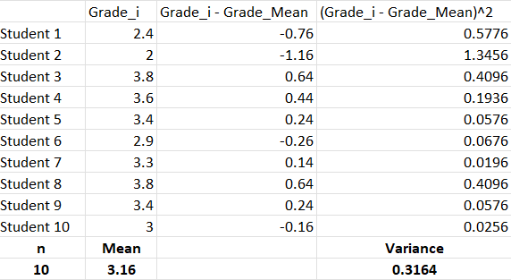
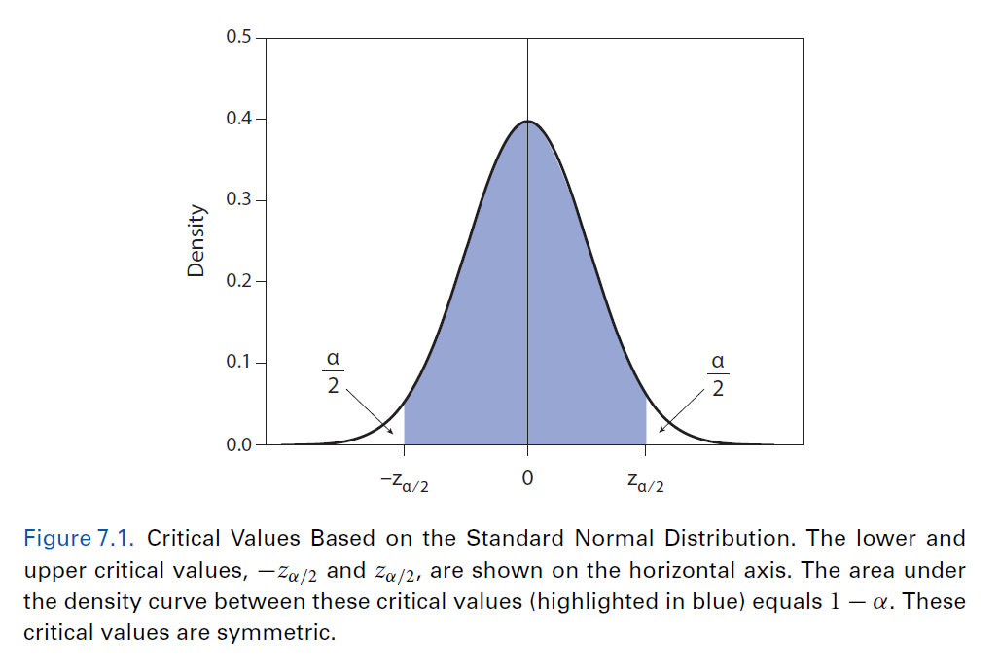
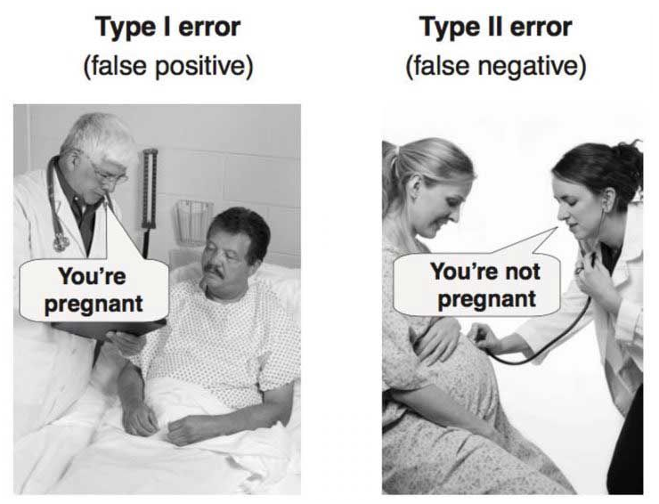
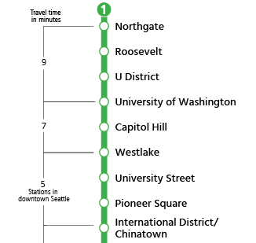

```{r setup, include=FALSE}
knitr::opts_chunk$set(echo = TRUE, warning = F,message = F,error = F)

rm(list=ls())

# load libraries
library(ggpubr)     # for arranging plots together
library(estimatr)
library(tidyverse)
library(plm)

theme_set(cowplot::theme_cowplot() + 
            theme(axis.text.x = element_text(size = 16, color = "black")))


# Simulation

set.seed(123)  # Set seed for reproducibility
n <- 100  # Number of observations
air_pollution <- pmax(rnorm(n, mean=4),0)  # Predictor 1 (significant)
water_pollution <- pmax(rnorm(n, mean=1),0)  # Predictor 2 (non-significant)
climate_change <- 2 * air_pollution + 0.165 * water_pollution + rnorm(n)


```


# Module IV

- This module introduces and reviews the topic of causation in science. 
  - *Statistical Inference*.
  - *Hypothesis test*.
  - *Multivariate regression*.


# Statistical inference: estimation

 - In statistical inference, we are concerned with making **predictions** (inferences) about a **DGP** or *population* based on information obtained from a *sample*.
 
 -  This involves the following key concepts:
    - **Estimand**: The **quantity of interest** from the data-generating process that we aim to estimate or infer.
    - **Estimator**: A statistical **method** or **formula** used to estimate the estimand based on sample data.
    - **Estimate**: it is the calculated value that serves as the **best guess** or approximation of the estimand based on the available information from the sample.
  
  
# Estimand, estimator, and esitmate


 -  Statistical inference involves using **estimators** to obtain **estimates** of **estimands** from sample data to make predictions about the population.

::: columns
:::: column

\vspace{5mm}

  - Analogy: have you ever heard about the *ecce homo*?


::::
:::: column

```{r, echo=FALSE, out.width="60%", fig.align='center'}
knitr::include_graphics(path="images/ecce_homo.png")
```

::::
:::


# Estimand, estimator, and esitmate

```{r, echo=FALSE, out.width="60%", fig.align='center'}
knitr::include_graphics(path="images/estimand.png")
```


# Estimand, estimator, and esitmate

```{r, echo=FALSE, out.width="60%", fig.align='center'}
knitr::include_graphics(path="images/estimator.png")
```


# Estimand, estimator, and esitmate

```{r, echo=FALSE, out.width="60%", fig.align='center'}
knitr::include_graphics(path="images/estimate.png")
```


# Estimand, estimator, and esitmate

::: columns
:::: column

\vspace{5mm}

  - **Estimates** are *best guesses*, but they never return you the *"true"*.


::::
:::: column

```{r, echo=FALSE, out.width="60%", fig.align='center'}
knitr::include_graphics(path="images/ecce_homo2.png")
```

::::
:::


# Populations and samples

Population Parameter:

- A population **parameter** is a numerical value that describes a characteristic of a **population**.

- It is a **fixed and unknown** value that we aim to estimate or infer using statistical methods.

Sample Statistic:

- A sample **statistic** is a numerical value that describes a characteristic of a **sample**.

- It is calculated from the data of a sample and is used to estimate or make **inferences** about population parameters.


# Sample statistics

- A **sample mean** that represents a social process:

\begin{equation}
\bar{X} = \frac{1}{n} (X_1 + X_2 + ... + X_n) = \frac{1}{n} \sum_{i=1}^n X_i
\end{equation}


- The **sample variance** that we estimate:

\begin{equation}
S^2 = \frac{1}{n} \sum_{i=1}^n (X_i - \bar{X})^2
\end{equation}


# Sample statistics

```{r, echo=FALSE, fig.align='center', out.width="90%"}

```


# Populations and samples


- Typically, we seek to learn features from **populations**, but studying the entire population is unfeasible.

- Thus, we rely on **samples** to make **inferences** under different **assumptions**.


\begin{table}[ht]
\centering
\begin{tabular}{lcc}
\hline
\textbf{Parameter/Statistic} & \textbf{Population} & \textbf{Sample} \\
\hline
Mean & $\mu$ & $\bar{X}$ \\
Variance & $\sigma^2$ & $\hat{\sigma}^2$ or $s^2$ \\
Standard deviation & $\sigma$ & $\hat{\sigma}$ or $s$ \\
Slope/coefficient & $\beta$ & $\hat{\beta}$ or $b$ \\
\hline
\end{tabular}
\caption{Comparison of Population Parameters and Sample Statistics}
\label{tab:parameters_statistics}
\end{table}


# Populations and samples

- *Example*: We want to learn the mean GPA of the University of Washington (population) through random sampling  students.

```{r, echo=FALSE, fig.align='center', out.width="90%"}
knitr::include_graphics("images/Sample.png")
```


# Populations and samples

```{r, echo=FALSE, fig.align='center', out.width="90%"}
knitr::include_graphics("images/Sample1.png")
```


# Populations and samples

```{r, echo=FALSE, fig.align='center', out.width="90%"}
knitr::include_graphics("images/Sample2.png")
```


# Populations and samples

```{r, echo=FALSE, fig.align='center', out.width="90%"}
knitr::include_graphics("images/Sample3.png")
```

# Populations and samples


```{r, echo=FALSE, fig.align='center', out.width="90%"}
knitr::include_graphics("images/Sample4.png")
```

# Populations and samples


```{r, echo=FALSE, fig.align='center', out.width="90%"}
knitr::include_graphics("images/Sample5.png")
```


# Estimation: Bias

- However, how can we tell if these are good estimates?

  - Ideally, we would compute the estimation error or **bias**.
  

\begin{equation}
\text{bias} = estimate - truth = \bar{X} - \mu
\end{equation}


\begin{table}[ht]
\centering
\begin{tabular}{ccc}
\hline
$n$ & \textbf{bias} &  $\bar{X} - \mu$ \\
\hline
 $50$ & $-0.40$ & $3.02-3.42$ \\
 $75$ & $0.29$ & $3.71-3.42$ \\
 $100$ & $-0.24$ & $3.18-3.42$ \\
 $150$ & $-0.17$ & $3.25-3.42$ \\
 $200$ & $0.11$ & $3.53-3.42$ \\
\hline
\end{tabular}
\caption{What is the extent of bias in our estimates?}
\label{tab:bias}
\end{table}


# Estimation: Consistency

- What may happen if we repeat this "experiment" and we increase the sample in each iteration?


```{r, echo=FALSE, fig.align='center', out.width="90%"}
knitr::include_graphics("output/convergence.pdf")
```


# Estimation: Bias and Consistency

- **Unbiasedness**: an estimator $\bar{X}$ of a parameter $\mu$ is unbiased if and only if:

\begin{equation}
E(\bar{X}) = \mu
\end{equation}


- **Consistency**: an estimator is consistent if for a sequence $\{X_n\}$ to converge to a limit $\mu$ as  $n \to \infty$, we have:
\begin{equation}
\lim_{n \to \infty} X_n = \mu
\end{equation}

However, an unbiased estimator with high variability is impractical because it will return **high prediction error** (MSE) as:
\begin{equation}
MSE = Var + bias^2
\end{equation}


# Estimation

- Furthermore, they do not provide information about the **uncertainty** or precision of the estimate. 

- **Confidence intervals** (CIs) address this issue by providing a range of plausible values for the **estimate**.

  - CIs are based on the principles of probability and sampling variability.
  - Different samples from the **same** population will yield different confidence intervals.

To construct **confidence intervals**, we need to estimate the standard deviation to determine the standard error.


# Uncertainty: standard errors.


- The **sample standard deviation** is simply the square root of the variance (see second slide).

\begin{equation}
\hat{\sigma} = \sqrt{\hat{\sigma}^2}
\end{equation}

- To characterize the variability of an estimator, we compute the **standard error**:

\begin{equation}
SE(\bar{X}) = \frac{\hat{\sigma}}{\sqrt{n}}
\end{equation}


<!-- # Uncertainty: standard errors. -->

<!-- **Important remark**: the formula for the sample standard error, $SE(\bar{X})$, is **NOT** the same as the standard error of the coefficients in linear regression, $SE(\hat{\beta})$. Why? -->

<!-- \begin{equation} -->
<!-- SE(\hat{\beta}) = \sqrt{\frac{{\hat{\sigma}^2}}{{\sum_{i=1}^{n}(x_i - \bar{x})^2}}} -->
<!-- \end{equation} -->


# Uncertainty: critical values.


To calculate the margin of error, we need to choose a **critical value**. Critical values influence the interpretation and outcome of the analysis because:

- constructing **confidence intervals**, and

- determining the **significance level** in hypothesis tests.


\begin{table}[h]
\centering
\begin{tabular}{|c|c|c|}
\hline
\textbf{Significance Level} & \textbf{Critical Value} & \textbf{Confidence Interval} \\
\hline
$0.1$ & $1.645$ & $1-0.1=0.9 \quad (90\%)$ \\
$0.05$ & $1.96$ & $1-0.05=0.95 \quad (95\%)$ \\
$0.01$ & $2.576$ & $1-0.01=0.99 \quad (99\%)$ \\
\hline
\end{tabular}
\caption{Common Critical Values and Confidence Intervals}
\end{table}


# Uncertainty: margin of error.

Once we have the standard error and select a critical value, the **margin error**, $ME$, and the **confidence intervals** are estimated as follows:

\begin{equation}
ME = \text{{critical value}} \times SE(\bar{X})
\end{equation}

\begin{equation}
\begin{aligned}
\text{Confidence Interval} & = \left( \bar{X} - ME, \bar{X} + ME \right) \\
                           & = ( CI_{lower}, CI_{upper} )
\end{aligned}
\end{equation}


# Uncertainty: example

\scriptsize
```{r}
dat <- read_csv("data/students.csv")
names(dat)

# Randomly sample 40 observations
sampled_data <- sample(dat$GPA, size = 40, replace = F)

(GPA_mean <- mean(sampled_data) ) # sample mean

(GPA_sd <- sd(sampled_data)) # sample standard deviation

(GPA_se <- GPA_sd / sqrt( length(sampled_data) ) ) # sample standard errors
```


# Uncertainty: example

**Question**: Is the sample mean biased estimator? Is the population mean within the confidence interval of our estimator?

\scriptsize
```{r}

statistics <- tibble(
  mean = GPA_mean,
  CI_lwr = GPA_mean - (1.96 * GPA_se),
  CI_upr = GPA_mean + (1.96 * GPA_se)
)

mean(dat$GPA) # population mean of GPA

statistics

```


# Uncertainty: interpreting confidence intervals

- We rely on samples for making **inferences**. To determine if our estimations approach the true population parameter, we use **confidence intervals.**

- A **confidence interval** is a range of plausible estimates.

- The **confidence level**, denoted as $(1- \alpha)$ or simply $1 - \text{significance level}$, is **interpreted** as the probability that the confidence interval **will contain** the true population parameter **over hypothetical replications**.

# Uncertainty: interpreting confidence intervals

  - *Example*: a **95%** confidence interval implies that if we were to **hypothetically repeat** the estimation and construct confidence intervals for each sample/estimate, approximately 95% of those intervals **would** contain the *true* parameter.
  


# Imai (2018, p. 328) - critical values

```{r, echo=FALSE, fig.align='center', out.width="100%"}

```


# Uncertainty: interpreting confidence intervals

- Resampling and estimating the GPA of the same population (UW) over 100 iterations with a significance **level of 0.1** (90% confidence intervals).

```{r, echo=FALSE, fig.align='center', out.width="90%"}
knitr::include_graphics("output/ci90.pdf")
```


# Uncertainty: interpreting confidence intervals

- Resampling and estimating the GPA of the same population (UW) over 100 iterations with a significance **level of 0.05** (95% confidence intervals).

```{r, echo=FALSE, fig.align='center', out.width="90%"}
knitr::include_graphics("output/ci95.pdf")
```


# Uncertainty: interpreting confidence intervals

- Resampling and estimating the GPA of the same population (UW) over 100 iterations with a significance **level of 0.01** (99% confidence intervals).

```{r, echo=FALSE, fig.align='center', out.width="90%"}
knitr::include_graphics("output/ci99.pdf")
```


# Takeaways

- Understand **bias** and **consistency**.

- Estimates must always inform of **uncertainty**.

- The impact of the **critical value** ($\alpha$) on constructing confidence intervals.

-  Wider confidence intervals increase the likelihood of the *"true value"* being within the intervals over **hypothetical replications**.
    - **Question**: Why might someone want to calculate narrower confidence intervals?

# Time to code a little bit!

 - Open the file `Confint.rmd`


# Hypothesis Testing: motivation

 - We have drawn a distinction between a population and a sample. However, how do we know that the sample reflects the population of interest?
 
 - Due to inherent **variability** in the data, the sample may **not perfectly reflect** the entire population.

  - Through a **t-test**, we assess whether the observed difference between the sample mean and the **hypothesized value** exceeds what is expected due to chance (aka random sampling variability alone).


# Hypothesis Testing: motivation

- What if the sample mean is really off from the population mean?

```{r, echo=FALSE, fig.align='center', out.width="90%"}
knitr::include_graphics("images/Sample_off.png")
```


# Hypothesis Testing

- Hypothesis testing is used to make inferences about population **parameters** based on **sample** data.

- It involves formulating **null** and **alternative hypotheses** and evaluating the evidence against the null hypothesis.

  - **Null Hypothesis** ($H_0$): a statement of no effect or no difference between groups or variables (*proof by contradiction*).
  - **Alternative Hypothesis** ($H_a$): contradicts the null hypothesis and suggests the presence of an effect or a difference between groups or variables.

- **Goal**: Does the *evidence* from the sample supports the **null** hypothesis or provides evidence for the **alternative** hypothesis?


# Hypothesis Testing


- **T-test**: quantifies the difference between the **sample** statistic and the hypothesized **population** parameter relative to the variability within the data.

  - It takes into account the **sample size** ($N$) and the **standard error** ($SE$) of the statistic to assess the likelihood of observing such a difference by chance.

- **Significance Level** ($\alpha$): The predetermined **threshold** for rejecting the null hypothesis.


# Hypothesis Testing: p-values

- **P-value**: it measures the **strength of evidence** against the null hypothesis, we compare it with the significance level to determine if we **reject or fail to reject** the null ($H_0$).
  - p-value is **large**: suggest insufficient evidence to reject the null hypothesis.
  - p-value is **low**:  stronger evidence against the null, favoring the alternative($H_a$).


# Hypothesis Testing: error types

- There is a clear trade-off between **Type I** and **Type II** errors in that minimizing type I error usually increases the risk of type II error.

\centering
\begin{tabular}{|c|c|c|}
\hline
\textbf{Decision} & $H_0$ is True & $H_0$ is False \\
\hline
Retain $H_0$ & Correct  & \textbf{Type II Error} \\
\hline
Reject $H_0$ & \textbf{Type I Error} & Correct \\
\hline
\end{tabular}


# Hypothesis Testing: error types


```{r, echo=FALSE, fig.align='center', out.width="90%"}

```


# Hypothesis Testing Process

1. State the **null** and **alternative** hypotheses.

2. Choose a test statistic and the **significance level** ($\alpha$).

3. Estimate the test statistic, in our case the **t-value**.

4. Compute the **p-value**, and compare it with with the significance level. 
    - For example, is $p\text{-value} < \alpha$ ?

5. Reject the null hypothesis if the $p\text{-value}$ is less than or equal to $\alpha$.


# Hypothesis Testing Process


- We will focus on a scenario where we want to assess the **association** of air and water **pollution** on **climate change**.

  - *Disclaimer*: this data was simulated.

\scriptsize
```{r, echo=FALSE,fig.width=8,fig.height=4}
dat <- data.frame(air_pollution, water_pollution)
dat <- tidyr::gather(dat, key = "type", value = "pollution")

# Create density plot
ggplot(dat, aes(x = pollution, fill = type)) +
  geom_density(alpha = 0.2) +
  labs(x = "Pollution", y = "Density") +
  scale_fill_manual(values = c("air_pollution" = "blue", "water_pollution" = "red")) +
  geom_vline(xintercept = mean(air_pollution), linetype="dashed",color="blue") +
  geom_vline(xintercept = mean(water_pollution), linetype="dashed",color="red") +
  theme_minimal()+
  theme(axis.text = element_text(size = 12),
        axis.title = element_text(size = 14)) 

```


# Hypothesis Testing Process

- We define a theoretical model:

\begin{equation}
cc = \alpha + \beta_1 \text{air} + \beta_2 \text{water} + \epsilon
\end{equation}


1. State the null and alternative hypotheses:
    - **Null Hypothesis** ($H_0$): air ($\beta_1$) or water ($\beta_2$) pollution are **not** associated with climate change. In other words, $\beta_1=0$ or $\beta_2=0$.
    - **Alternative Hypothesis** ($H_a$): air or water are associated with climate change. In other words, $\beta_1\neq0$ or $\beta_2\neq0$


2. Set the **significance level**, the default in social sciences is 0.05.

# Hypothesis Testing Process

- The `lm()` function estimates the t-statistic and p-values (steps 3 and 4) using the fitted model and sample data argument.

\scriptsize
```{r}
model <- lm(climate_change ~ air_pollution + water_pollution)
round(coef(model), digits=2)
```
\normalsize

- Estimated model, are the coefficients statistically significant?

\begin{equation}
cc =  0.65 + 1.87 \text{air} + 0.18 \text{water}
\end{equation}


# Model summary

- Use the function `summary()` for the t-test and the p-value.

- Can we reject $H_0$? 
    - Remember that the **significant level** that we choose was 0.05 *(critical value = 1.96)*.

\tiny
```{r}
summary(model)
```


# Hypothesis Testing and Confidence Intervals

- Can we reject $H_0$? 

\scriptsize
```{r}
(p_value <- summary(model)$coefficients[, "Pr(>|t|)"])
(t_value <- summary(model)$coefficients[, "t value"])

p_value < 0.05 # is p-value < significant level?

t_value > 1.96 # is t-value > critical value?
```


# Hypothesis Testing and Confidence Intervals

- Can we reject $H_0$? 

  - $H_0$ air pollution: sufficient evidence to reject the null hypothesis.
  - $H_0$ water pollution: insufficient evidence to reject the null hypothesis.

- **Conclusion**: air pollution has a positive significant **association** with climate change. However, water pollution is **not statistically significant**.
    - When an estimated coefficient is not statistically significant, we mean that it is not **significantly different from 0**. In this case, $\beta_2 = 0\neq0.18$, because we fail to reject the null  $H_0$ for water pollution.

- However...


# Hypothesis Testing and Confidence Intervals

- Can we really reject $H_0$ if we instead use a significant level of **0.10**? 

```{r}
p_value < 0.1 # is p-value < significant level?

t_value > 1.645 # is t-value > critical value?
```

- Type I and II error trade-off.


# Hypothesis Testing and Confidence Intervals


- **Confidence intervals** and **hypothesis testing** are closely related.

- If the confidence interval **contains the null** value, $\beta_2 = 0$, the null hypothesis cannot be rejected.

- The p-value in hypothesis testing **quantifies** the strength of evidence against the null hypothesis, similar to how confidence intervals provide a range of **plausible** parameter values. 
  - **Important**: the p-value is **NOT** the probability that the null is true.


# Hypothesis Testing and Confidence Intervals

```{r, echo=FALSE, fig.align='center', out.width="100%"}
knitr::include_graphics("output/CIs90.pdf")
```

# Hypothesis Testing and Confidence Intervals

```{r, echo=FALSE, fig.align='center', out.width="100%"}
knitr::include_graphics("output/CIs95.pdf")
```

# Hypothesis Testing and Confidence Intervals

```{r, echo=FALSE, fig.align='center', out.width="100%"}
knitr::include_graphics("output/CIs99.pdf")
```


# Tools for learning

```{r, echo=FALSE, fig.align='center', out.width="60%"}

```


# Tools for learning

```{r, echo=FALSE, fig.align='center', out.width="80%"}

```


# Tools for learning

```{r, echo=FALSE, fig.align='center', out.width="60%"}

```


# Tools for learning: trade-offs

```{r, echo=FALSE, fig.align='center', out.width="60%"}

```

# Tools for learning

- **Question**: what do these pictures have in common?

```{r, echo=FALSE, fig.align='center', out.width="60%"}

```


# Tools for learning: models

- These pictures depict various **models**; they are tools for **learning.**

\vspace{1mm}

\emph{"All models are wrong but some are useful"}

\hfill George Box, 1976

\vspace{1mm}

- Models are 
  - **simplified representations** of real-world systems.
  - facilitate **clear and concise** communication of complex ideas.
  - help to understand **complex systems** by highlighting significant variables.


# Good luck on your journey!

- Please, be aware that you have only scratched the surface of a vast array of methodologies for scientific inference, including
    - Time series and panel data.
    - Multilevel models.
    - Bayesian inference.
    - machine learning for prediction and discovery.
    - Deep learning.
    - Applied causal inference, among others ...


# Good luck on your journey!

- Remember the importance of consistency, bias, and efficiency in statistical inference.

  - **Consistency** is the most important property, before bias and efficiency!

# Good luck on your journey!

- I hope you gained valuable insights from my labs.

- **Best of luck** with your future endeavors, and please... 
    - take a moment to fill out the **course evaluations** if you haven't done so already!

Best wishes,

Lucas


